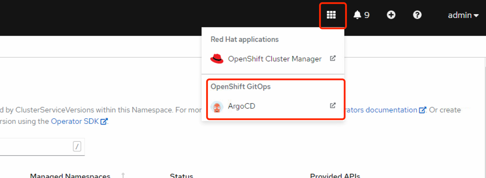

### Install Openshift GitOps Operator 
在 Web 控制台中安装 GitOps Operator
先决条件： 以管理员身份登录 OpenShift 集群。

打开 Web 控制台的 Administrator 视角，并进入左侧菜单中的 Operators → OperatorHub。
搜索 OpenShift GitOps，点 Red Hat OpenShift GitOps 标题，然后点 Install 按钮。
注意不是community的那个argocd  

Red Hat OpenShift GitOps 将安装在集群的所有命名空间中。

在 Installed Operators 中看到状态为 Succeeded 即完成。  

Red Hat OpenShift GitOps Operator 会自动创建一个可用的 Argo CD 实例，可在 openshift-gitops namespace中使用。

使用 Red Hat OpenShift GitOps，可以通过 Argo CD 将 Git 目录的内容与包含集群自定义配置的应用程序同步到openshift。

```bash
[root@bastion pipeline]# oc get pod -n openshift-gitops 
NAME                                                          READY   STATUS    RESTARTS   AGE
cluster-b5798d6f9-6pmmb                                       1/1     Running   0          5m1s
kam-69866d7c48-pvzb6                                          1/1     Running   0          4m59s
openshift-gitops-application-controller-0                     1/1     Running   0          4m59s
openshift-gitops-applicationset-controller-6447b8dfdd-28845   1/1     Running   0          4m59s
openshift-gitops-redis-74bd8d7d96-rpbdg                       1/1     Running   0          4m59s
openshift-gitops-repo-server-c999f75d5-pbg9m                  1/1     Running   0          4m59s
openshift-gitops-server-6ff4fbc8f6-czd4l                      1/1     Running   0          4m59s
[root@bastion pipeline]# oc get route -n openshift-gitops 
NAME                      HOST/PORT                                                        PATH   SERVICES                  PORT    TERMINATION            WILDCARD
cluster                   cluster-openshift-gitops.apps.ocp4.example.com                          cluster                   8080    reencrypt/Allow        None
kam                       kam-openshift-gitops.apps.ocp4.example.com                              kam                       8443    passthrough/None       None
openshift-gitops-server   openshift-gitops-server-openshift-gitops.apps.ocp4.example.com          openshift-gitops-server   https   passthrough/Redirect   None
```

openshift-gitops-server-openshift-gitops.apps.ocp4.example.com
这个就是 argocd 控制台，通过route 访问或者页面上点击快捷链接


用户名 admin  

获取 Argo CD 登录密码的方法1  
导航到 web 控制台的 Developer 视角。
导航到 openshift-gitops 项目。
使用左侧导航面板导航到 Secrets 页面。
选择 openshift-gitops-cluster 实例来显示密码。
复制密码。
使用此密码和 admin 作为用户名在新窗口中登录到 Argo CD UI。

获取密码方法2
```bash
[root@bastion pipeline]# oc extract secret/openshift-gitops-cluster -n openshift-gitops --to=-
# admin.password
5ERxXZwsbK8ihanHfW9UdSAyjGDg0lY4

```

### 创建demo应用程序
在 Argo CD 仪表板中，点 New App 按钮添加新的 Argo CD 应用程序。


### 参考链接  
https://access.redhat.com/documentation/zh-cn/openshift_container_platform/4.7/html/cicd/getting-started-with-openshift-gitops