Argo CD是用于Kubernetes的声明性GitOps连续交付工具。

简单说，把应用部署所需的 yaml 存放在git上，自动分发到不同k8s集群，并对应用的状态做监视。

### ArgoCD 架构

ArgoCD 通过 kubernetes 控制器连续监视正在运行的应用程序，并将当前的状态与所需的目标状态（在Git存储库中指定）进行比较。当前状态偏离目标状态的已部署应用程序被标记为OutOfSync。 ArgoCD报告并可视化差异，同时提供了自动或手动将当前状态同步到所需目标状态的能力。 在Git存储库中对所需目标状态所做的任何修改都可以自动应用并反映在指定的目标环境中。


主要特征：  
将应用程序自动部署到指定的目标环境  
支持多种配置管理/模板工具（Kustomize、Helm、Ksonnet、Jsonnet、plain-YAML）  
能够管理和部署到多个集群  
SSO 集成（OIDC、OAuth2、LDAP、SAML 2.0、GitHub、GitLab、Microsoft、LinkedIn）  
用于授权的多租户和 RBAC 策略  
回滚/随处回滚到 Git 存储库中提交的任何应用程序配置  
应用资源健康状况分析  
自动配置漂移检测和可视化  
自动或手动将应用程序同步到所需状态  
提供应用程序活动实时视图的 Web UI  
用于自动化和 CI 集成的 CLI  
Webhook 集成（GitHub、BitBucket、GitLab）  
自动化的访问令牌  
PreSync、Sync、PostSync 挂钩以支持复杂的应用程序部署（例如蓝色/绿色和金丝雀升级）  
应用程序事件和 API 调用的审计跟踪  
普罗米修斯指标  
用于覆盖 Git 中的 ksonnet/helm 参数的参数覆盖  

**我认为最大的两个特点：**
1. 借助git 的版本管理能力，更好的实现了资源的版本管理。弥补了k8s目前只有deployment具备版本管理的不足。  
2. 应用发布的可视化能力，特别是 helm 的可视化，可以复用模板，且界面面向用户友好。纯 yaml 的方式，在大规模推进中，对开发人员不够友好。

### Install Openshift GitOps Operator 
在 Web 控制台中安装 GitOps Operator
先决条件： 以管理员身份登录 OpenShift 集群。

打开 Web 控制台的 Administrator 视角，并进入左侧菜单中的 Operators → OperatorHub。
搜索 OpenShift GitOps，点 Red Hat OpenShift GitOps 标题，然后点 Install 按钮。
注意不是community的那个argocd  

Red Hat OpenShift GitOps 将安装在集群的所有命名空间中。

在 Installed Operators 中看到状态为 Succeeded 即完成。  

Red Hat OpenShift GitOps Operator 会自动创建一个可用的 Argo CD 实例，可在 openshift-gitops namespace中使用。

使用 Red Hat OpenShift GitOps，可以通过 Argo CD 将 Git 目录的内容与包含集群自定义配置的应用程序同步到openshift。

```bash
[root@bastion pipeline]# oc get pod -n openshift-gitops 
NAME                                                          READY   STATUS    RESTARTS   AGE
cluster-b5798d6f9-6pmmb                                       1/1     Running   0          5m1s
kam-69866d7c48-pvzb6                                          1/1     Running   0          4m59s
openshift-gitops-application-controller-0                     1/1     Running   0          4m59s
openshift-gitops-applicationset-controller-6447b8dfdd-28845   1/1     Running   0          4m59s
openshift-gitops-redis-74bd8d7d96-rpbdg                       1/1     Running   0          4m59s
openshift-gitops-repo-server-c999f75d5-pbg9m                  1/1     Running   0          4m59s
openshift-gitops-server-6ff4fbc8f6-czd4l                      1/1     Running   0          4m59s
[root@bastion pipeline]# oc get route -n openshift-gitops 
NAME                      HOST/PORT                                                        PATH   SERVICES                  PORT    TERMINATION            WILDCARD
cluster                   cluster-openshift-gitops.apps.ocp4.example.com                          cluster                   8080    reencrypt/Allow        None
kam                       kam-openshift-gitops.apps.ocp4.example.com                              kam                       8443    passthrough/None       None
openshift-gitops-server   openshift-gitops-server-openshift-gitops.apps.ocp4.example.com          openshift-gitops-server   https   passthrough/Redirect   None
```

openshift-gitops-server-openshift-gitops.apps.ocp4.example.com
这个就是 argocd 控制台，通过route 访问或者页面上点击快捷链接


用户名 admin  

获取 Argo CD 登录密码的方法1  
导航到 web 控制台的 Developer 视角。
导航到 openshift-gitops 项目。
使用左侧导航面板导航到 Secrets 页面。
选择 openshift-gitops-cluster 实例来显示密码。
复制密码。
使用此密码和 admin 作为用户名在新窗口中登录到 Argo CD UI。

获取密码方法2
```bash
[root@bastion pipeline]# oc extract secret/openshift-gitops-cluster -n openshift-gitops --to=-
# admin.password
5ERxXZwsbK8ihanHfW9UdSAyjGDg0lY4

```

### 创建demo应用程序

创建 project 并给 argocd 授权，以便能够创建应用，直接给了 cluster-admin，不用后面去一个个 project 授权。

```bash
oc new-project demo-yaml
oc adm policy add-cluster-role-to-user cluster-admin system:serviceaccount:openshift-gitops:openshift-gitops-argocd-application-controller  
oc adm policy add-cluster-role-to-user cluster-admin system:serviceaccount:openshift-gitops:openshift-gitops-argocd-server

```

在 Argo CD 仪表板中，点 New App 按钮添加新的 Argo CD 应用程序。

通过页面键入的参数，其实是生成了一个 argocd 的CRD，kind: Applications

General:  
  Name: spring-yaml  #自定义  
  Project: default  #不要改  
  SyncPolicy : Manual   #同步策略，手动或自动  

Source:
  RepositoryURL: https://github.com/cai11745/openshift-gitops-getting-started.git  
  Revision: HEAD  
  Path: app-yaml  #git repo 子目录  

Destination:  
  Server: 'https://kubernetes.default.svc'    #不要改  
  Namespace: demo-yaml   #应用发布的namespace

参数解读翻到下一节  

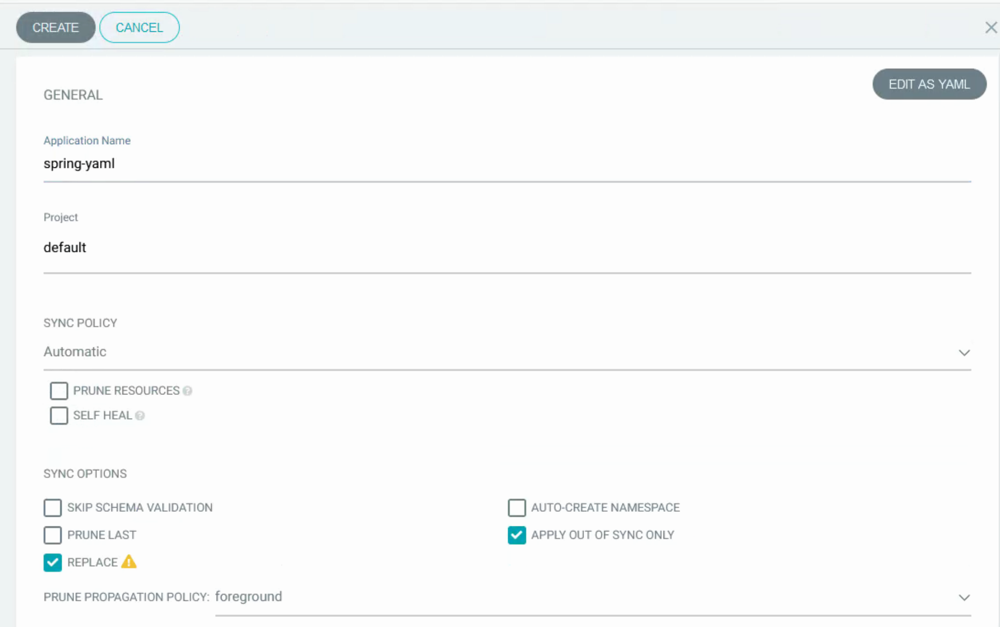


如果 git 目录中存在 kustomization.yaml 或者 values.yaml（helm） ，会展示自定义参数配置页面。  
这是两种 k8s 常用的自定义模板的方式，可以实现 yaml 复用，特别是spring 应用，可以很方便共用模板。  
也可以利用社区大量的 helm 模板很方便的提供中间件，helm仓库都不需要去另外创建。  

可以参照我 git repo 中 app-helm  app-kustomization 目录。

Kustomize 支持参数见官方说明
https://argo-cd.readthedocs.io/en/stable/user-guide/kustomize/
Kustomize 页面  
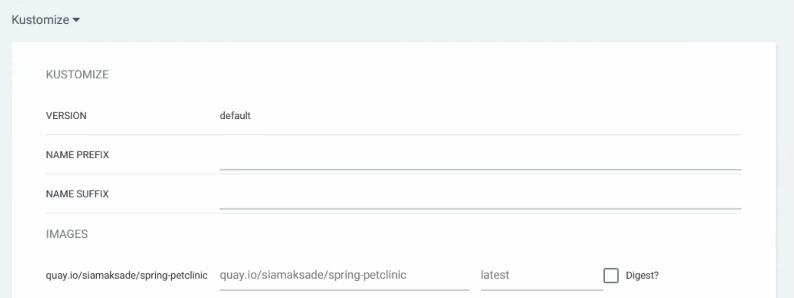

helm  
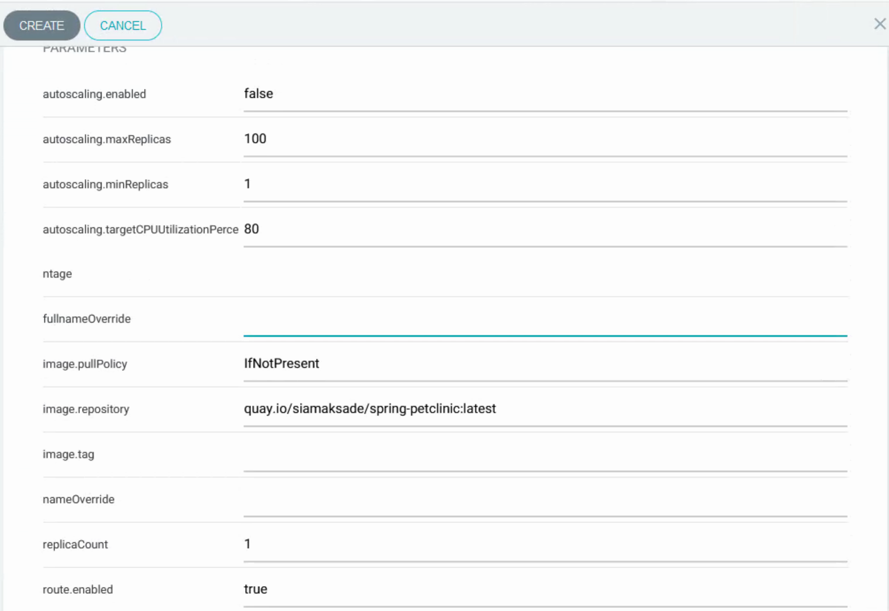

查看后台的 applications 资源对象，spring-yaml 是我们刚刚创建的  
```bash
[root@bastion ~]# oc get applications -A
NAMESPACE          NAME                   SYNC STATUS   HEALTH STATUS
openshift-gitops   spring-helm            Synced        Healthy
openshift-gitops   spring-kustomization   Synced        Healthy
openshift-gitops   spring-yaml            Synced        Healthy
```

argocd applications 视图
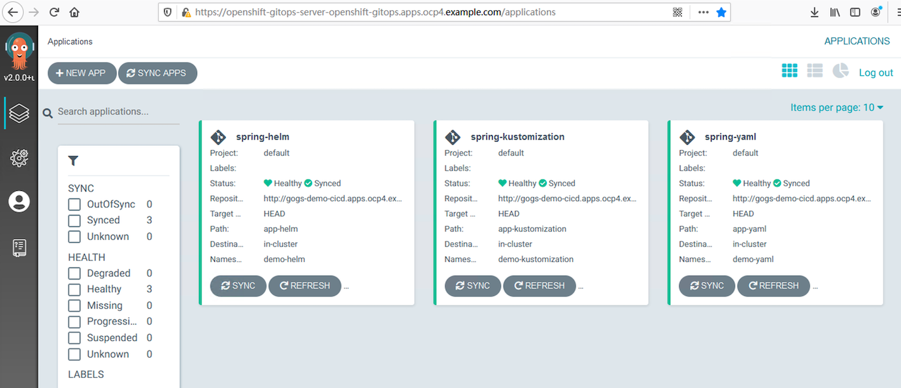

应用详情  

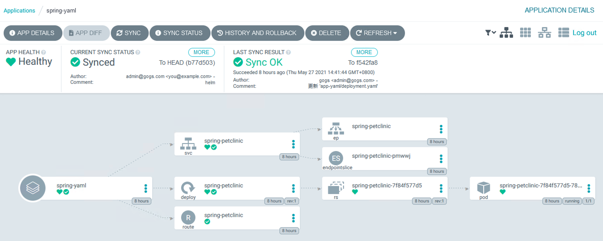

### 参数详解

GENERAL:  
Application Name: 自己定义，和应用deployment的名称无关，只是在argocd里面的标识。

Project： 和 openshift 的project 无关，是argocd 里的概念，可以在页面的 settings-->project 中配置。这个框输入时会列出可选项，初始安装后只有 default 可选。

SYNC POLICY: Manual 和 Automatic，很简单，手动和自动同步git的内容到openshift。Automatic 下还有两个参数： PRUNE RESOURCES  和 SELF HEAL。自动模式3分钟同步一次，或者配置webhook自动触发。  

- PRUNE RESOURCES：默认情况下（作为一种安全机制），当Argo CD检测到Git中不再定义资源时，自动同步将不会删除资源。要删除资源，可以通过执行手动同步（选中PRUNE）。还可以通过这边 enable PRUNE RESOURCES 作为自动同步的一部分。（这个适合直接通过yaml 定义应用的情况，而kustomization.yaml 或者helm 方式二次定义的会有点问题）  
- SELF HEAL 自动修复，比如我们直接在openshift 修改了deployment的参数，会被自动重置为git 中对应的初始状态，所以这种情况下在openshift 上直接修改应用配置是不会生效的。

SYNC OPTIONS:  
- SKIP SCHEMA VALIDATION: 对于特定类别的对象，必须 kubectl apply 使用 --validate=false 标志。例如使用的 kubernetes 类型 RawExtension，例如 ServiceCatalog。  
- AUTO-CREATE NAMESPACE: 自动创建应用部署指定的namespace。需要对 system:serviceaccount:openshift-gitops:openshift-gitops-argocd-application-controller 授权 cluster-admin  
- PRUNE LAST: 此功能允许在其他资源已部署或者变更并变成健康状态之后，再执行同步。也可以加到resource 的 annotations，比如多个deployment 存在依赖的时候。  
- APPLY OUT OF SYNC ONLY: 当前，当使用自动同步进行同步时，ArgoCD会应用程序中的每个对象。对于包含数千个对象的应用程序，这会花费很长时间，并且会对api服务器造成不必要的压力。启用此选项，将仅同步那些”out-of-sync“的资源。
- REPLACE: 默认情况下，Argo CD执行kubectl apply 操作来应用存储在Git中的配置。在某些情况下kubectl apply 是不合适的。例如，资源规格可能太大，无法被 kubectl apply 命令写入到 kubectl.kubernetes.io/last-applied-configuration annotation 。在这种情况下，你可以使用Replace=true同步选项。如果设置了Replace=true sync选项，Argo CD将使用kubectl Replace或kubectl create命令应用更改。

PrunePropagationPolicy=background 允许在同步期间使用后台删除
同步时后台清除自愿 - 现在的逻辑可能导致 delet 卡死
Foreground - k8s 必须删除所有 child 资源才能删除资源本身

Source:  
  RepositoryURL: git repo url  
  Revision: 可以指定branch，或者tag，默认branch - HEAD  
  Path: yaml存放的目录

DESTINATION:  
  Cluster URL: 选默认的不要改，是k8s api地址。 https://kubernetes.default.svc  
  Namespace: 应用要部署到哪个 namespace，注意权限。  

更多参数解读见此  
https://argo-cd.readthedocs.io/en/latest/user-guide/sync-options/

完整版 Application 示例  
https://argoproj.github.io/argo-cd/operator-manual/application.yaml

### Application 管理  
以下是 Application 详情页，具备应用管理与状态、日志、事件查看能力，可以手动同步应用并比对版本差异

#### APP DETAILS
点击 “APP DETAILS” 或下方树状图最左边的图标，进入 Application 配置页面。  
一共有 SUNNARY PARAMETERS MANIFEST DIFF EVENTS 五个菜单。

SUMMARY: 创建 application 时候配置的 sync policy，gitrepo ，path 等。  
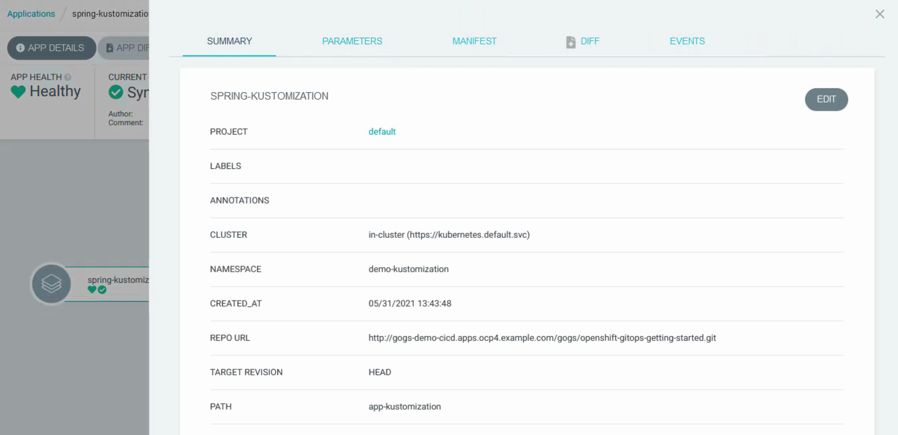

PARAMETERS: 同样是 helm 或者 Kustomize 时候自定义参数，和创建时候参数一样。
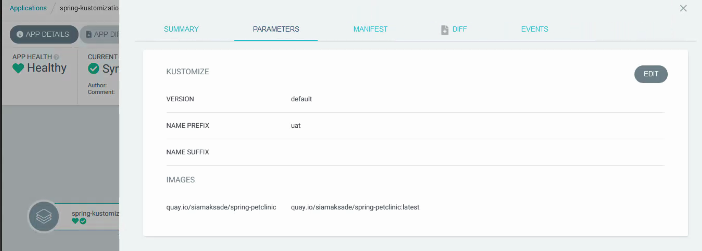

MANIFEST: 前面SUMMARY和PARAMETERS 内容的yaml方式展现。  
就是 applications 的内容。也可以通过后台查看  
oc -n openshift-gitops get applications spring-kustomization -o yaml
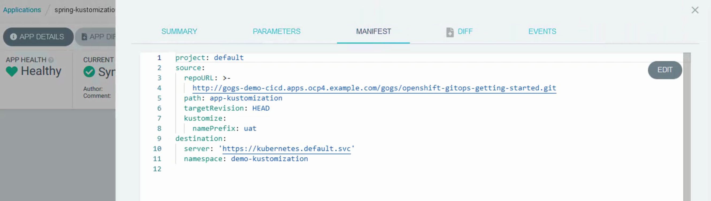

DIFF: 当 CURRENT SYNC STATUS 为不同步的时候，查看 DIFF 能看到git repo 与当前环境资源的差异。  
选中 Compact diff 会只显示差异内容的上下三行。  

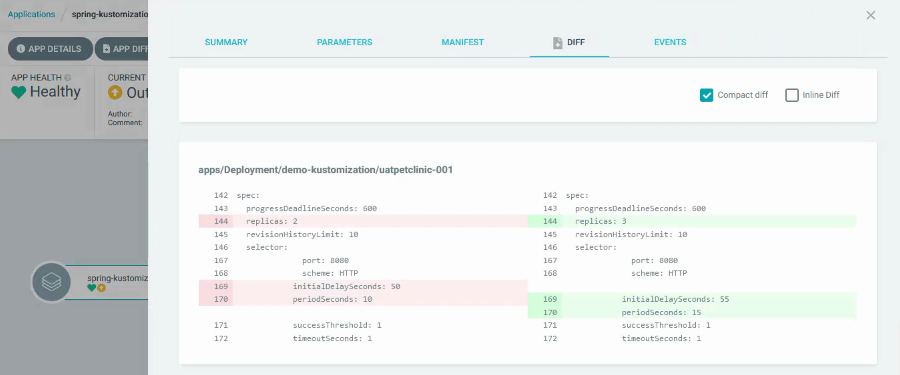

EVENTS: applications 的事件记录，更新、同步记录等，也可以 oc describe applications 查看  
oc -n openshift-gitops describe applications spring-kustomization 

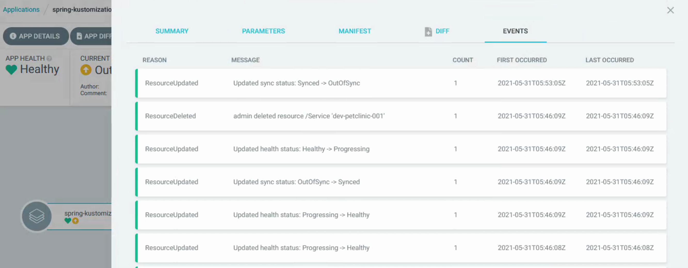

#### APP DIFF
就是跳转到上面 APP DETAILS 的 DIFF 页面

#### SYNC
DRY RUN 参数，可以用来测试是否能够成功更新，用来预验证 yaml 文件。验证结果会体现在 LAST SYNC RESULT。  
Synchronize resources 可以选择文件针对性更新。  
其他参数和创建时候类似。  
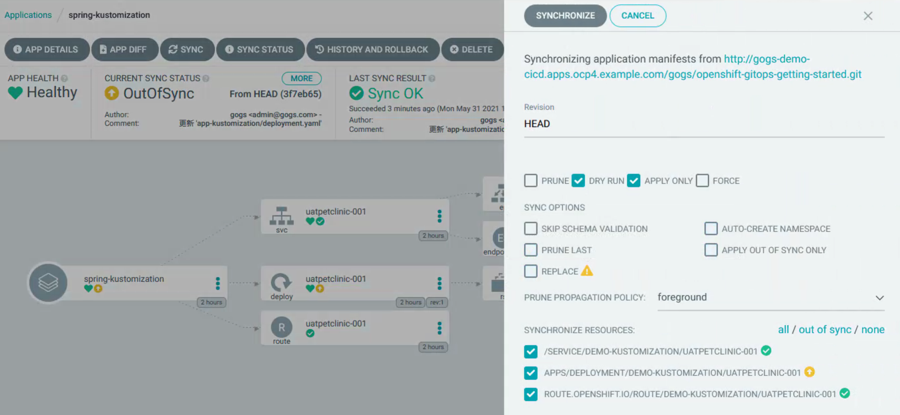

#### SYNC STATUS
就是更新记录了。

#### HISTORY AND ROLLBACK
升级的版本记录，并且支持回滚。  
这也是 argocd 的一个重大特性，全量 yaml 的版本管理。  
k8s 本身的版本管理只局限于 deployment，而其他资源对象 configmap，service 等都是不具备版本管理能力的。  
可以用于快速回滚，而不需要去 git 一个个回滚文件然后同步。
可以看到每个版本的发布时间，发布时长，运行时长。配置的自定义参数。 点版本最右边那三个点，展开选择 rollback 即可。  
Revision 是 short commit id  

```bash
[root@bastion openshift-gitops-getting-started]# git rev-parse --short HEAD
2544b34
```

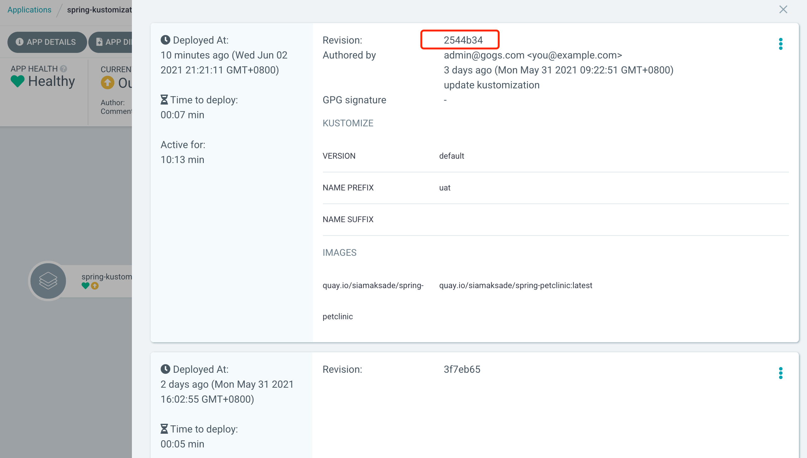

回滚后，由于回到历史版本，会与 git repo 不一致，状态会是OutOfSync  

#### DELETE
删除 application 有三种模式  
前两个会删除关联的资源，结果是一致的。  
第三个不会删除关联的资源。  

Foreground
前台删除，点击后，application 会显示资源的删除过程，至完全删除。

Background 
后台删除，点击后，application 直接不见了，后台会执行删除动作。

Non-cascading  
只删除 applications，关联的资源不删除，就是deployment 等都保留，只删除 argocd 的 applications 对象。

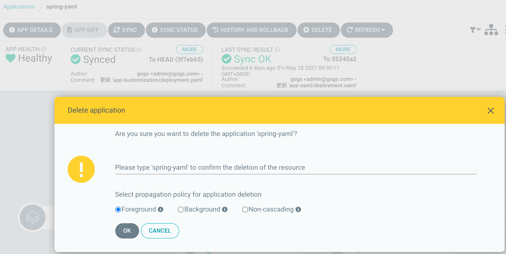

#### CURRENT SYNC STATUS
不管是修改git repo 内容或者后台修改 deploy 或者svc 之类，CURRENT SYNC STATUS 就会变成 OutOfSync，并会把不同步的资源用黄色图标标注。  

#### 面向资源的操作
可以对 deployment，svc，route 等直接单独进行同步操作。查看对象 yaml ，event。可以直观的展示每个资源存在的时长。    
对于 deploy，rs，pod 还可以查看日志，具备了简单的运维能力，大部分情况可以不去看 openshift 平台就可以完成应用的更新操作。

### FAQ

#### 1. services is forbidden: User "system:serviceaccount:openshift-gitops:openshift-gitops-argocd-application-controller" cannot create resource "services" in API group "" in the namespace "gitops-demo"

[root@bastion ~]# oc adm policy add-role-to-user admin system:serviceaccount:openshift-gitops:openshift-gitops-argocd-application-controller -n gitops-demo

这是针对 project 的授权，也可以通过 add-cluster-role-to-user cluster-admin 给全局 admin，这样不用每次分别对 project 授权。

#### 2. Unable to create application: application references project gitops-demo which does not exist

这是 GENERAL - Project 填写了不存在的 project，这个不是openshift 的project，是argocd内部概念。默认情况下 只有 default，可以在 argocd 页面的 settings-->project 中配置新增。

#### 3. Unable to execute resource action: deployments.apps "spring-petclinic" is forbidden: User "system:serviceaccount:openshift-gitops:openshift-gitops-argocd-server" cannot patch resource "deployments" in API group "apps" in the namespace "demo-yaml"

解决: 直接全局授权  
[root@bastion ~]# oc adm policy add-cluster-role-to-user cluster-admin system:serviceaccount:openshift-gitops:openshift-gitops-argocd-server


### 参考链接  
https://access.redhat.com/documentation/zh-cn/openshift_container_platform/4.7/html/cicd/getting-started-with-openshift-gitops

https://argo-cd.readthedocs.io/en/stable/user-guide/

https://argoproj.github.io/argo-cd/