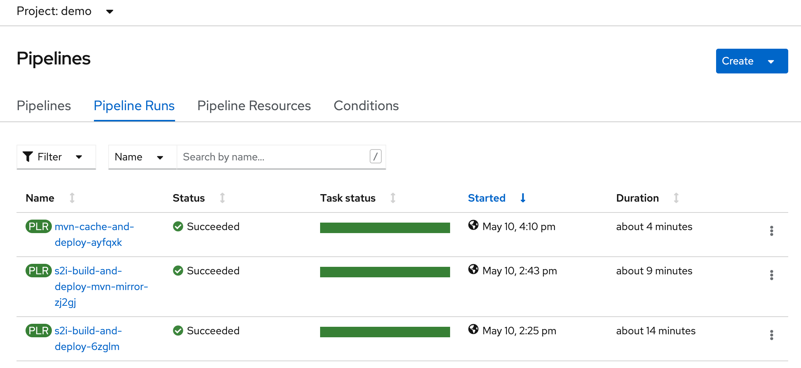
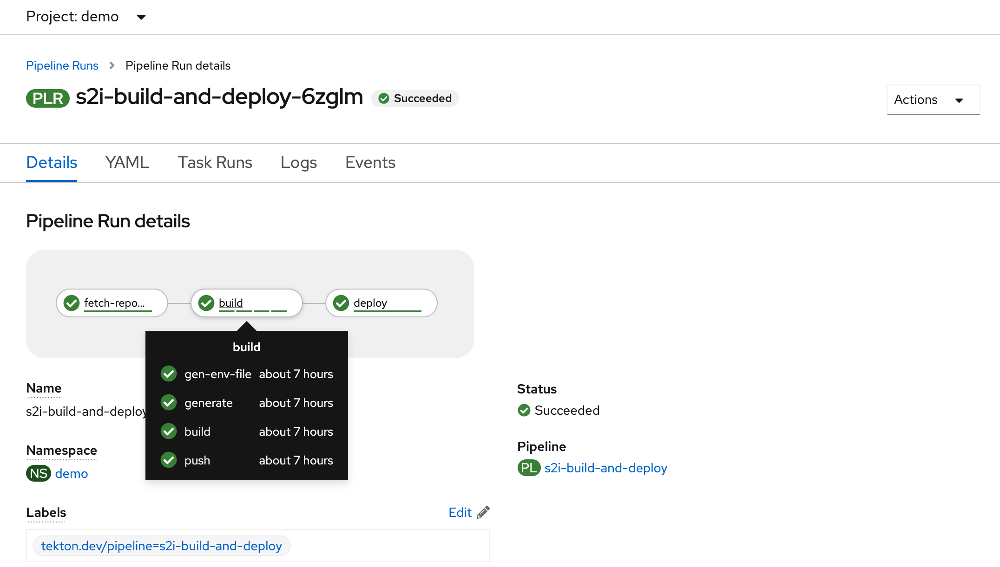
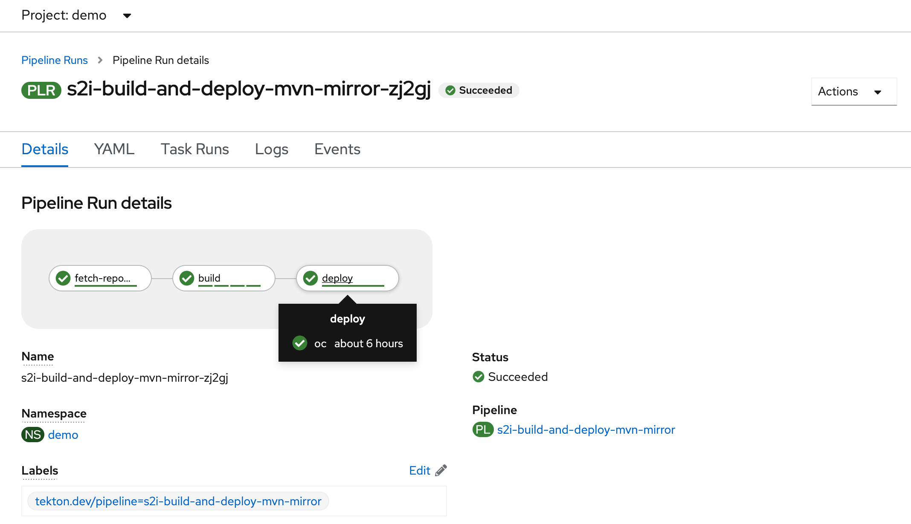
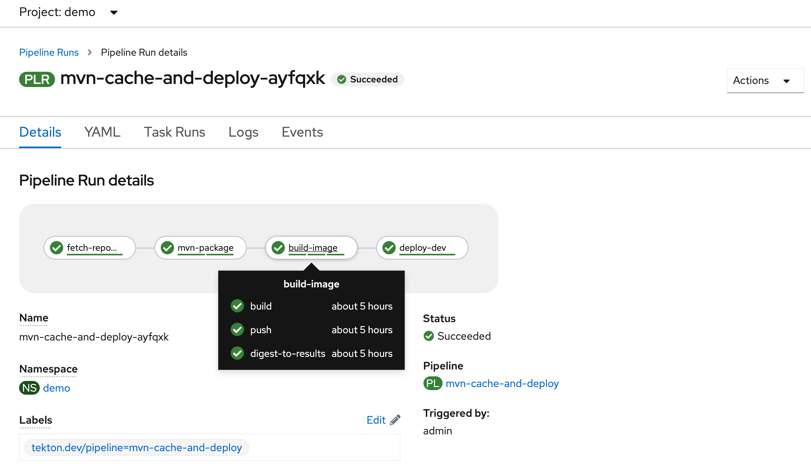
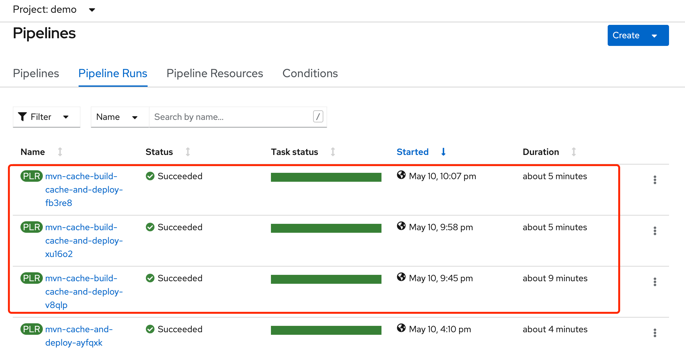

## Openshift Pipeline 调优

通过调整 pipeline 循序渐进的提高过程效率，并适应多场景。  
与之前在openshift使用jenkins 做pipeline 时候的思路是一致的，通过配置私服地址和缓存编译文件到持久化存储，以提高编译效率。  

调整前后，pipeline运行用时分别为 14min -> 9min -> 4min  


### demo 场景介绍
使用到的pipeline 和自定义 task 存在github  
https://github.com/cai11745/ocp4-userguide/tree/master/attachment/pipeline

**pipeline #1： s2i-build-and-deploy.yaml**

openshift自带demo，pipeline一共三步，使用到了三个 clustertask： git-clone，s2i-java-8，openshift-client

**pipeline #2： s2i-build-and-deploy-mvn-mirror.yaml**
在上一个基础上增加了MAVEN_MIRROR_URL参数，可以使用从内网拉取编译所需文件，如 nexus  

**pipeline #3： mvn-cache-and-deploy.yaml**
pipeline 一共4步，第一步拉取代码。  
第二步编译，使用自定义task mvn-repo-task.yaml，并到了新的workspace: maven-cache 并做持久化，用于缓存编译所需依赖。  
第三步 通过Dockerfile build image and push，使用 clustertask： buildah，Dockerfile 默认路径是git 根目录下，推送到openshift内置仓库，使用的 serviceaccount 叫 pipeline，每个project下面已经有了，具备push image 权限，若是外部仓库，需要另做权限处理。  
第四步 通过 deployment/service/route yaml 发布应用，yaml 文件放在 git repo 的 k8s目录，通过 environments/dev/kustomization.yaml 指定yaml路径，每次执行 pipeline 会更新 deployment 的镜像。使用到了自定义task  deploy-app-task.yaml

**pipeline #4: mvn-cache-build-cache-and-deploy**
这一步的初衷是想把镜像文件持久化，不需要每次拉取基础镜像。不过没有达到预期效果，要5分钟，比pipeline#3 还多了一分钟。
待再调整，调整 storage driver 或者使用 node 节点镜像文件数据。  

**使用的java应用源码**  
https://github.com/cai11745/spring-petclinic.git  
在官方基础增加了 Dockerfile，k8s目录（deployment/service/route yaml），environments目录。这些内容在pipeline #3才会用到。

整个demo过程需要使用到私有git库（在线的也行，可能拉取会慢一些），私有nexus（必备）  
并准备几个网络存储用于缓存数据，nfs或其他都可。（必备）

### pipeline #1 s2i-build-and-deploy  

所有 yaml 以github 最新为准。

1-s2i-build-and-deploy.yaml  
1-pipelinerun-s2i-build-and-deploy.yaml  

```bash
[root@bastion pipeline]# oc create -f 1-s2i-build-and-deploy.yaml 
[root@bastion pipeline]# oc create -f 1-pipelinerun-s2i-build-and-deploy.yaml 
```

pipelinerun-xx.yaml 内置了默认参数，可以通过oc create -f 1-pipelinerun-xx.yaml 快速生成pipelinerun，不需要通过页面去 start pipeline  
pipelinerun-xx.yaml 需要用 oc create -f 命令创建，不能用 apply -f ，generateName: s2i-build-and-deploy- 最后会加一串随机数作为新的pipelinerun 的名称  

这个pipeline 比较简单，通过拉取源代码，然后s2i 制作镜像，最后 oc new-app --docker-image 命令发布应用，这个pipelinerun 反复执行应该会报错，应用最后创建应用时候会同名，需要修改下 pipelinerun，IMAGE_NAME 参数里 image-registry.openshift-image-registry.svc:5000/demo/s2i-java:v1 ， s2i-java 是应用名称，重复执行需要不一样。  

在 pipeline #3 开始将不存在这个问题，主要是调整下 deploy 这一步的逻辑。




```bash
[root@bastion pipeline]# cat 1-s2i-build-and-deploy.yaml 
apiVersion: tekton.dev/v1beta1
kind: Pipeline
metadata:
  name: s2i-build-and-deploy
spec:
  params:
    - name: IMAGE_NAME
      type: string
      default: image-registry.openshift-image-registry.svc:5000/PROJECT/APP_NAME:TAG
      description: The application image to build. Need to replace the PROJECT,APP_NAME,TAG.
    - name: GIT_REPO
      type: string
      description: The application git repository
    - name: GIT_REVISION
      type: string
      default: master
      description: The application git revision
  workspaces:
    - name: workspace
  tasks:
    - name: fetch-repository
      taskRef:
        name: git-clone
        kind: ClusterTask
      workspaces:
        - name: output
          workspace: workspace
      params:
        - name: url
          value: $(params.GIT_REPO)
        - name: revision
          value: $(params.GIT_REVISION)
        - name: subdirectory
          value: ""
        - name: deleteExisting
          value: "true"

    - name: build
      taskRef:
        name: s2i-java-8
        kind: ClusterTask
      runAfter:
        - fetch-repository
      workspaces:
        - name: source
          workspace: workspace
      params:
        - name: IMAGE
          value: $(params.IMAGE_NAME)
        - name: TLSVERIFY
          value: "false"

    - name: deploy
      taskRef:
        name: openshift-client
        kind: ClusterTask
      runAfter:
        - build
      params:
        - name: ARGS
          value:
            - "new-app"
            - "--docker-image"
            - "$(params.IMAGE_NAME)"

[root@bastion pipeline]# cat 1-pipelinerun-s2i-build-and-deploy.yaml 
apiVersion: tekton.dev/v1beta1
kind: PipelineRun
metadata:
  generateName: s2i-build-and-deploy-
spec:
  params:
  - name: IMAGE_NAME
    value: image-registry.openshift-image-registry.svc:5000/demo/s2i-java:v1
  - name: GIT_REPO
    value: http://gogs-demo-cicd.apps.ocp4.example.com/gogs/spring-petclinic.git
  - name: GIT_REVISION
    value: master
  pipelineRef:
    name: s2i-build-and-deploy
  serviceAccountName: pipeline
  workspaces:
  - name: workspace
    persistentVolumeClaim:
      claimName: petclinic-dev-workspace

```

### pipeline #2 s2i-build-and-deploy-mvn-mirror  

2-s2i-build-and-deploy-mvn-mirror.yaml  
2-pipelinerun-s2i-build-and-deploy-mvn-mirror.yaml 

与 pipeline#1 的区别就是在build 这一步，把 MAVEN_MIRROR_URL 参数添加到了pipeline中，这个参数 s2i-java-8 clustertask 原本就是支持的。每次从私服拉取编译所需jar，并且私服会缓存文件，不需要每次从互联网获取。




```bash
[root@bastion pipeline]# cat 2-s2i-build-and-deploy-mvn-mirror.yaml 
apiVersion: tekton.dev/v1beta1
kind: Pipeline
metadata:
  name: s2i-build-and-deploy-mvn-mirror
spec:
...

    - name: MAVEN_MIRROR_URL
      type: string
      default: ""
      description: The base URL of a mirror used for retrieving artifacts. e.g. http://nexus_addr/repository/maven-public
  workspaces:
    - name: workspace
  tasks:
    - name: fetch-repository
...
    - name: build
      taskRef:
        name: s2i-java-8
        kind: ClusterTask
      runAfter:
        - fetch-repository
      workspaces:
        - name: source
          workspace: workspace
      params:
        - name: IMAGE
          value: $(params.IMAGE_NAME)
        - name: TLSVERIFY
          value: "false"
        - name: PATH_CONTEXT
          value: spring-petclinic
        - name: MAVEN_MIRROR_URL
          value: $(params.MAVEN_MIRROR_URL)

    - name: deploy
...

[root@bastion pipeline]# cat 2-pipelinerun-s2i-build-and-deploy-mvn-mirror.yaml 
apiVersion: tekton.dev/v1beta1
kind: PipelineRun
metadata:
  generateName: s2i-build-and-deploy-mvn-mirror-
spec:
  params:
  - name: IMAGE_NAME
    value: image-registry.openshift-image-registry.svc:5000/demo/java-mvn-cache:v1
  - name: GIT_REPO
    value: http://gogs-demo-cicd.apps.ocp4.example.com/gogs/spring-petclinic.git
  - name: GIT_REVISION
    value: master
  - name: MAVEN_MIRROR_URL
    value: http://nexus-demo-cicd.apps.ocp4.example.com/repository/maven-public/
  pipelineRef:
    name: s2i-build-and-deploy-mvn-mirror
  workspaces:
  - name: workspace
    persistentVolumeClaim:
      claimName: petclinic-dev-workspace

```

### pipeline #3  mvn-cache-and-deploy

mvn-repo-task.yaml  
deploy-app-task.yaml  
3-mvn-cache-and-deploy.yaml  
3-pipelinerun-mvn-cache-and-deploy.yaml  



使用到了两个自定义task。  
mvn-repo-task.yaml 相较 clustertask maven增加了一个workspace，并调整了maven参数 args， 增加了 Dmaven.repo.local=$(workspaces.mvn-repo.path)/.m2 用户将编译文件缓存到workspace  

```bash
[root@bastion pipeline]# cat mvn-repo-task.yaml 
apiVersion: tekton.dev/v1beta1
kind: Task
metadata:
  annotations:
    tekton.dev/pipelines.minVersion: 0.12.1
    tekton.dev/tags: build-tool
  name: maven-repo
  labels:
    app.kubernetes.io/version: '0.1'
    operator.tekton.dev/provider-type: community
spec:
  description: This Task can be used to run a Maven build, and '/root/.m2' repository data will be stored to the Workspace.
  params:
    - default: registry.example.com:5000/cloud-builders/mvn:3.5.0-jdk-8
      description: Maven base image
      name: MAVEN_IMAGE
      type: string
    - default:
        - package
      description: maven goals to run
      name: GOALS
      type: array
    - default: ''
      description: The Maven repository mirror url
      name: MAVEN_MIRROR_URL
      type: string
...

  workspaces:
    - description: The workspace consisting of maven project.
      name: source
    - description: The workspace consisting of the custom maven settings provided by the user.
      name: maven-settings
    - description: The workspace to store local maven  repositories.
      name: mvn-repo
  steps:
    - image: 'registry.example.com:5000/ubi8/ubi-minimal:8.2'
      name: mvn-settings
      resources: {}
      script: >
 
 ...

    - args:
        - -Dmaven.repo.local=$(workspaces.mvn-repo.path)/.m2
        - '-s'
        - $(workspaces.maven-settings.path)/settings.xml
        - $(params.GOALS)
      command:
        - /usr/bin/mvn
      image: $(params.MAVEN_IMAGE)
      name: mvn-goals
      resources: {}
      workingDir: $(workspaces.source.path)
```

deploy-app-task.yaml
先生成一个 kustomization.yaml，替换 k8s 目录下的 deployment.yaml  route.yaml  service.yaml 相关参数，如镜像，并将yaml导入openshift

```bash
[root@bastion pipeline]# cat deploy-app-task.yaml 
apiVersion: tekton.dev/v1beta1
kind: Task
metadata:
  name: deploy-app
spec:
  params:
    - name: DEPLOYMENT_NAME
      description: The name of deployment
      type: string
    - name: CURRENT_IMAGE
      description: The current image repo/image:tag in the manifests for the deployment
      type: string
    - name: NEW_IMAGE_NAME
      description: The new image repo/image to be deployed
      type: string
    - name: NEW_IMAGE_TAG
      description: The new image tag to be deployed
      type: string
      default: ""
    - name: NEW_IMAGE_DIGEST
      description: The digest of the new image to get deployed
      type: string
      default: ""
    - name: NAMESPACE
      description: The namespace for the deployment
      type: string
    - name: KUSTOMIZE_OVERLAY_DIR
      description: The subdirectory in configs git repo for the kustomize overlay to be applied
  workspaces:
  - description: The workspace consisting of maven project.
    name: source
  steps:
    - name: apply-manifests
      workingDir: $(workspaces.source.path)
      image: image-registry.openshift-image-registry.svc:5000/openshift/cli
      script: |

        find $(workspaces.source.path)

        cat >> $(workspaces.source.path)/$(params.KUSTOMIZE_OVERLAY_DIR)/kustomization.yaml <<- EOF

        images:
        - name: quay.io/siamaksade/spring-petclinic:latest
          newName: $(params.NEW_IMAGE_NAME)
          newTag: $(params.NEW_IMAGE_TAG)
          digest: $(params.NEW_IMAGE_DIGEST)
        EOF

        [[ "x$(params.NEW_IMAGE_DIGEST)" == "x" ]] && sed -i "/digest/d" $(workspaces.source.path)/$(params.KUSTOMIZE_OVERLAY_DIR)/kustomization.yaml
        [[ "x$(params.NEW_IMAGE_TAG)" == "x" ]] && sed -i "/newTag/d" $(workspaces.source.path)/$(params.KUSTOMIZE_OVERLAY_DIR)/kustomization.yaml

        echo "########################"  
        echo "## kustomization.yaml ##"
        echo "########################"

        cat $(workspaces.source.path)/$(params.KUSTOMIZE_OVERLAY_DIR)/kustomization.yaml

        echo "######## DRY RUN #######"
        oc apply -k $(params.KUSTOMIZE_OVERLAY_DIR) --dry-run=client -o yaml -n $(params.NAMESPACE)
        echo "########################"

        oc apply -k $(params.KUSTOMIZE_OVERLAY_DIR) -n $(params.NAMESPACE)
        oc rollout status deploy/$(params.DEPLOYMENT_NAME) -n $(params.NAMESPACE)

```

导入 task, pipeline，并执行 pipelinerun  
第一次run的时候，缓存jar 到网络存储，可能最终时长会比 pipeline#2 还久，再次run 就会体会到使用本地缓存的效率。  

```bash
[root@bastion pipeline]# oc create -f mvn-repo-task.yaml 
[root@bastion pipeline]# oc create -f deploy-app-task.yaml 
[root@bastion pipeline]# oc create -f 3-mvn-cache-and-deploy.yaml 
[root@bastion pipeline]# oc create -f 3-pipelinerun-mvn-cache-and-deploy.yaml 

```

```bash
[root@bastion pipeline]# cat 3-mvn-cache-and-deploy.yaml 
apiVersion: tekton.dev/v1beta1
kind: Pipeline
metadata:
  name: mvn-cache-and-deploy
spec:
  params:
    - name: NAMESPACE
      description: The namespace for the deployment
      type: string
    - name: APP_IMAGE
      type: string
      default: image-registry.openshift-image-registry.svc:5000/demo/spring-petclinic
      description: The application image to build
    - name: APP_IMAGE_TAG
      type: string
      default: v1
      description: The application image tag to build
    - name: GIT_REPO
      type: string
      description: The application git repository
      default: http://gogs-demo-cicd.apps.ocp4.example.com/gogs/spring-petclinic.git
    - name: pathToContext
      description: The path to the build context, used by Kaniko - within the workspace
      default: ./
    - name: GIT_REVISION
      type: string
      default: master
      description: The application git revision
    - name: MAVEN_MIRROR_URL
      type: string
      default: http://nexus-demo-cicd.apps.ocp4.example.com/repository/maven-public/
      description: The base URL of a mirror used for retrieving artifacts. e.g. http://nexus_addr/repository/maven-public
  workspaces:
    - name: source-cache
    - name: maven-settings
    - name: maven-cache
  tasks:
    - name: fetch-repository
      taskRef:
        name: git-clone
        kind: ClusterTask
      workspaces:
        - name: output
          workspace: source-cache
      params:
        - name: url
          value: $(params.GIT_REPO)
        - name: revision
          value: $(params.GIT_REVISION)
        - name: deleteExisting
          value: "true"
    - name: mvn-package
      taskRef:
        name: maven-repo
      runAfter:
      - fetch-repository
      workspaces:
      - name: source
        workspace: source-cache
      - name: mvn-repo
        workspace: maven-cache
      - name: maven-settings
        workspace: maven-settings
      params:
      - name: MAVEN_MIRROR_URL
        value: $(params.MAVEN_MIRROR_URL)
      - name: MAVEN_IMAGE
        value: registry.cn-hangzhou.aliyuncs.com/laocai/mvn:3.5.0-jdk-8
      - name: GOALS
        value:
        - package
        - -DskipTests=true

    - name: build-image
      taskRef:
        name: buildah
        kind: ClusterTask
      runAfter:
        - mvn-package
      workspaces:
        - name: source
          workspace: source-cache
      params:
        - name: IMAGE
          value: $(params.APP_IMAGE):$(params.APP_IMAGE_TAG)
        - name: BUILDER_IMAGE
          value: registry.example.com:5000/rhel8/buildah:v1

    - name: deploy-dev
      taskRef:
        name: deploy-app
      runAfter:
        - build-image
      params:
      - name: DEPLOYMENT_NAME
        value: spring-petclinic
      - name: CURRENT_IMAGE
        value: "quay.io/siamaksade/spring-petclinic:latest"
      - name: NEW_IMAGE_NAME
        value: $(params.APP_IMAGE)
      - name: NEW_IMAGE_TAG
        value: $(params.APP_IMAGE_TAG)
      - name: NAMESPACE
        value: $(params.NAMESPACE)
      - name: KUSTOMIZE_OVERLAY_DIR
        value: environments/dev
      workspaces:
      - name: source
        workspace: source-cache

```

pipelinerun  

```bash
[root@bastion pipeline]# cat 3-pipelinerun-mvn-cache-and-deploy.yaml 
apiVersion: tekton.dev/v1beta1
kind: PipelineRun
metadata:
  generateName: mvn-cache-and-deploy-
spec:
  params:
  - name: NAMESPACE
    value: demo
  pipelineRef:
    name: mvn-cache-and-deploy
  workspaces:
  - name: source-cache
    persistentVolumeClaim:
      claimName: petclinic-dev-workspace
  - name: maven-settings
    emptyDir: {}
  - name: maven-cache
    persistentVolumeClaim:
      claimName: m2-cache
```


### pipeline #4 mvn-cache-build-cache-and-deploy

buildah-cache-task.yaml  
4-mvn-cache-build-cache-and-deploy.yaml  
4-pipelinerun-mvn-cache-build-cache-and-deploy.yaml  

这是一个没有达到预期效果的pipeline，因为比上一个pipeline 用时反而更长了。  
与上一个pipeline 的区别是第三步 build-image， 我根据 clustertask buildah 修改了一个新的task，文件是buildah-cache-task.yaml

在 volumes varlibcontainers 这边使用了pvc，原来是 emptyDir

```bash
[root@bastion pipeline]# cat buildah-cache-task.yaml 
apiVersion: tekton.dev/v1beta1
kind: Task
metadata:
  name: buildah-cache
...
spec:
  params:
  - default: vfs
    description: Set buildah storage driver
    name: STORAGE_DRIVER
    type: string

...

  steps:
  - image: $(params.BUILDER_IMAGE)
    name: build
    resources: {}
    script: |
      buildah --storage-driver=$(params.STORAGE_DRIVER) bud \
        $(params.BUILD_EXTRA_ARGS) --format=$(params.FORMAT) \
        --tls-verify=$(params.TLSVERIFY) --no-cache \
        -f $(params.DOCKERFILE) -t $(params.IMAGE) $(params.CONTEXT)
    volumeMounts:
    - mountPath: /var/lib/containers
      name: varlibcontainers
    workingDir: $(workspaces.source.path)
  - image: $(params.BUILDER_IMAGE)
    name: push
    resources: {}
    script: |
      buildah --storage-driver=$(params.STORAGE_DRIVER) push \
        $(params.PUSH_EXTRA_ARGS) --tls-verify=$(params.TLSVERIFY) \
        --digestfile $(workspaces.source.path)/image-digest $(params.IMAGE) \
        docker://$(params.IMAGE)
    volumeMounts:
    - mountPath: /var/lib/containers
      name: varlibcontainers
    workingDir: $(workspaces.source.path)
...

  volumes:
  - name: varlibcontainers
    persistentVolumeClaim:
      claimName: var-lib-containers
  workspaces:
  - name: source
```



一些可能的原因和后续改进方向：
1. 调整 storage-driver，默认是 vfs 方式，一个镜像占用了 1.5G，制作镜像时候占用2.1G。而 java:8 基础镜像530M, jar 48M

当前试过 overlay，overlay2，在保存镜像文件时候报错。
```bash
+ buildah --storage-driver=overlay bud --format=oci --tls-verify=true --no-cache -f ./Dockerfile -t image-registry.openshift-image-registry.svc:5000/demo-cicd/spring-petclinic:v1 .
level=error msg="'overlay' is not supported over nfs at \"/var/lib/containers/storage/overlay\""
kernel does not support overlay fs: 'overlay' is not supported over nfs at "/var/lib/containers/storage/overlay": backing file system is unsupported for this graph driver
level=error msg="exit status 125"
```

查了一下vfs 的介绍，docker里运行docker，是一个典型的使用场景  
VFS存储驱动程序不是联合文件系统；相反，每个图层都是磁盘上的目录，并且没有写时复制支持。要创建一个新图层，先前的图层会进行“深层复制”。与其他存储驱动程序相比，这会导致磁盘性能下降和磁盘使用空间更多。但是，它强大，稳定，适用于各种环境。它也可以用作在测试环境中验证其他存储后端的机制。  
但并不建议在实际或者生产环境使用，但是对于需要进行简单验证的场景，或者需要测试Docker引擎的其他部件的场景，是很有价值的。对于在Docker中运行Docker的场景也很有用。

2. build 一步，buildah 原来有个 no-cache 参数，我去掉之后，并没有效果。

3. 使用 node 节点镜像数据文件，还没想好怎么做。这样的话，最好将执行 pipeline 的project 固定在几个node上。
  
### 一些注意事项
1. 以上每个pipeline 共用了一个存储，且都是直接使用的根目录。且每个pipeline 初始化时候都会清空目录，所以共用存储情况下，要避免同时执行。
还有一个办法，就是使用子目录，比如 git-clone 这个task，通过配置 subdirectory 参数可以使用 workspace 下的子目录，就避免了多个流水线共用一个根目录的情况。  

2. 使用到的镜像，用于执行任务的在 clustertask 或者pipeline 中可以指定，init container 需要在 csv 中修改  
```bash
[root@bastion ~]# oc -n openshift-operators get clusterserviceversions
NAME                                DISPLAY                       VERSION   REPLACES                            PHASE
redhat-openshift-pipelines.v1.4.0   Red Hat OpenShift Pipelines   1.4.0     redhat-openshift-pipelines.v1.3.1   Succeeded

# 修改 csv 中对应环境变量，然后查看 openshift-pipelines-operator pod 是否更新变量  
[root@bastion ~]# oc -n openshift-operators edit clusterserviceversions redhat-openshift-pipelines.v1.4.0
```

参照这篇文章最后
https://github.com/cai11745/ocp4-userguide/blob/master/DevOps/openshift-pipeline-Tekton-install.md

3. pipelinerun 默认使用的 serviceaccount 叫 pipeline，如果把镜像推到到其他project并发布，需要oc adm policy 授权。

### FAQ
#### pipeline #4 使用nfs 存储缓存镜像文件报错

因为容器运行用户为 root，nfs server端存储权限配置为 /nfs/storageclass *(rw,sync,all_squash)  
即所有用户使用nfs存储时候，用户都会被限制为 nfsnobody，导致容器使用时候 chown 失败  

解决方法：把nfs server 权限改为 /nfs/storageclass *(rw,sync,no_root_squash)  
即root 使用不限制，其他用户使用还是会被限制为 nfsnobody  
重新创建pvc即可

```bash
STEP-BUILD
+ buildah --storage-driver=vfs bud --format=oci --tls-verify=true --no-cache -f ./Dockerfile -t image-registry.openshift-image-registry.svc:5000/demo/spring-petclinic:v1 .
chown /var/lib/containers/storage/vfs: operation not permitted
level=error msg="exit status 125"

sh-4.4# id
uid=0(root) gid=0(root) groups=0(root),1000670000

[root@bastion storageclass]# ls  demo-cicd-var-lib-containers-pvc-16b94c24-cace-45a8-be7a-285439fea406/storage/ -l
total 0
drwx------ 2 nfsnobody nfsnobody 6 May  7 23:18 mounts
-rw-r--r-- 1 nfsnobody nfsnobody 0 May  7 23:18 storage.lock
drwx------ 2 nfsnobody nfsnobody 6 May  7 23:18 tmp
-rw-r--r-- 1 nfsnobody nfsnobody 0 May  7 23:18 userns.lock
drwx------ 2 nfsnobody nfsnobody 6 May  7 23:18 vfs

```

### 参考链接

https://ibm-developer.gitbook.io/cloudpakforapplications-appmod/ci-cd/tekton-tutorial-openshift

