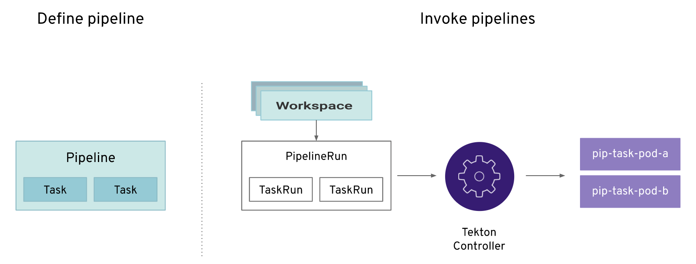
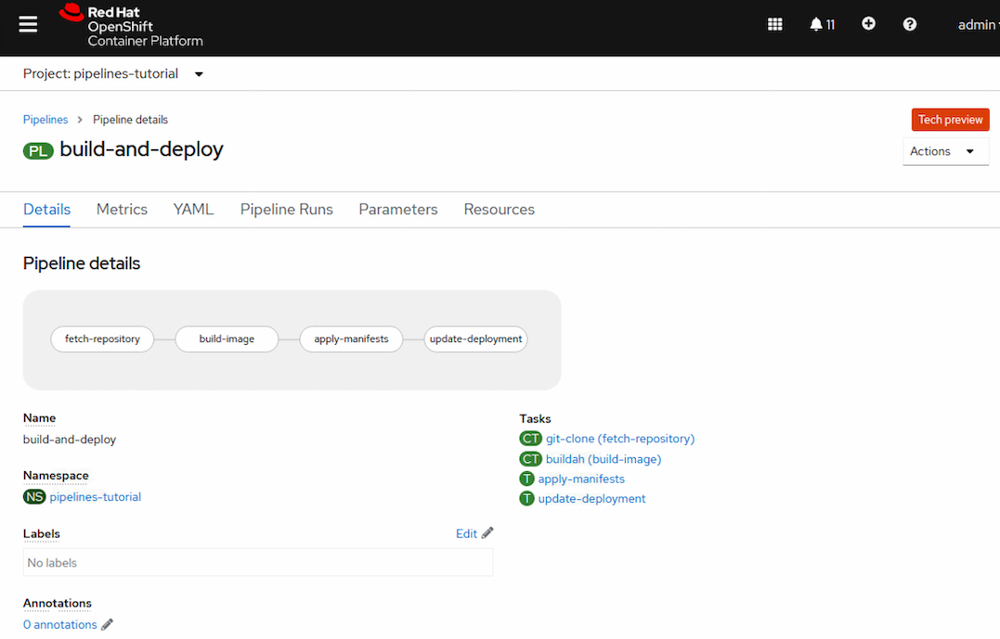
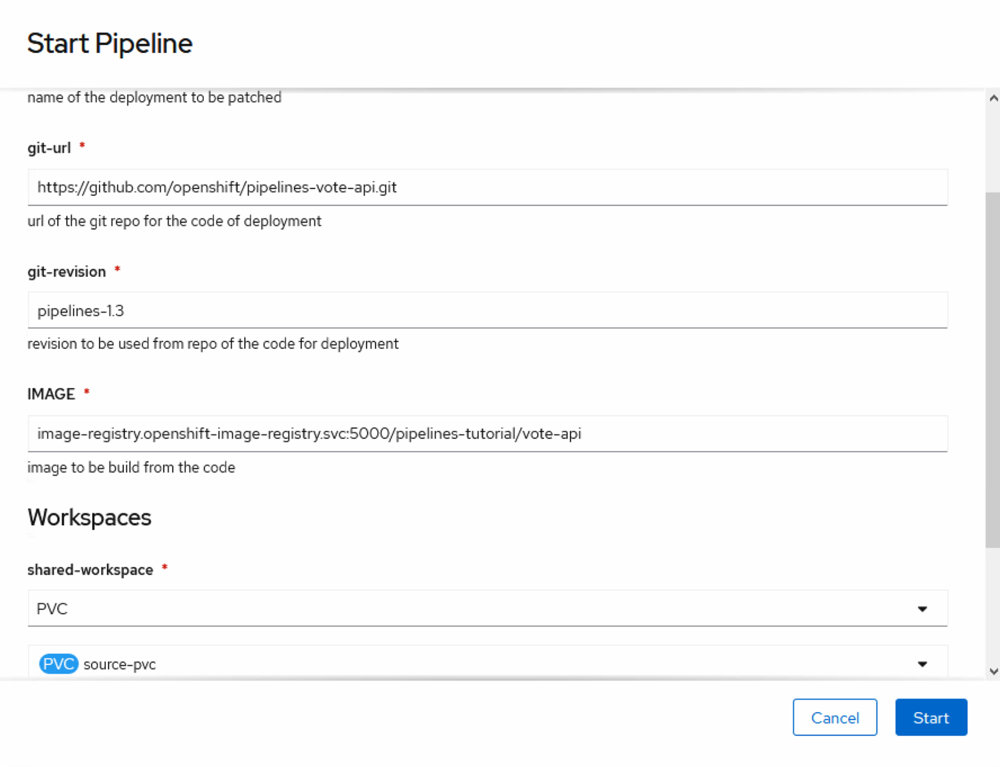
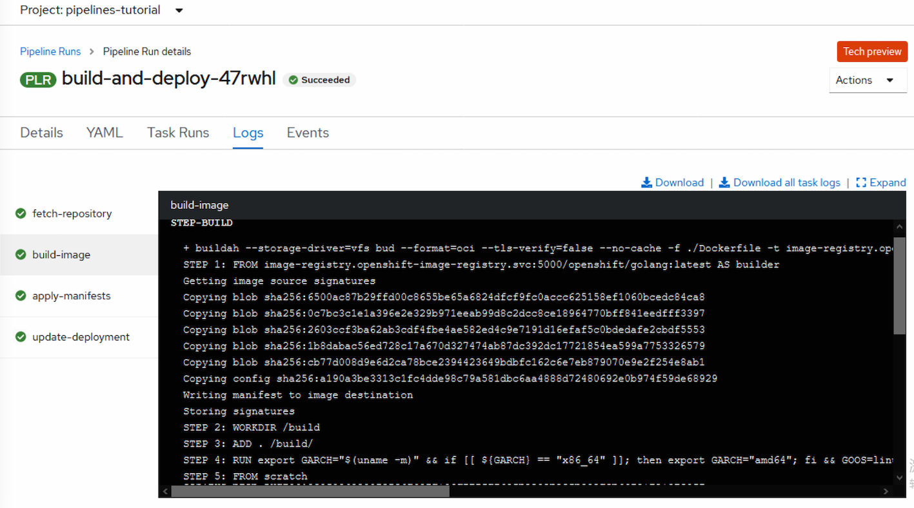
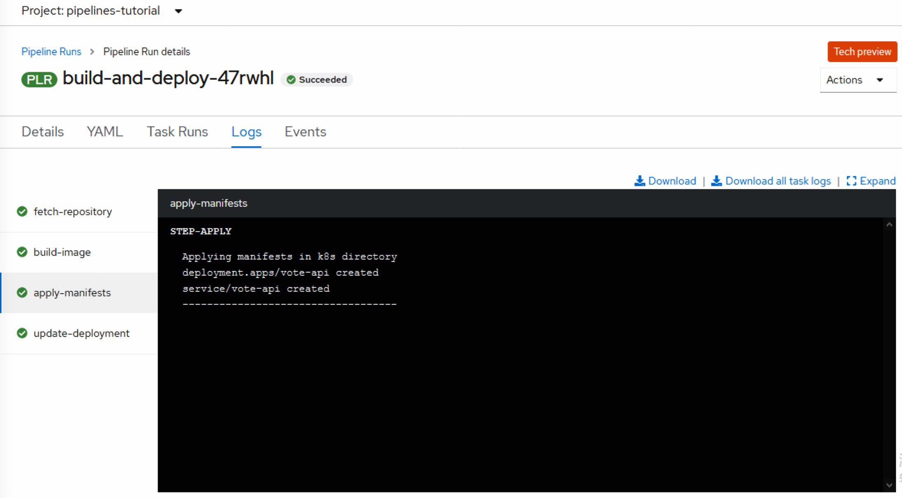
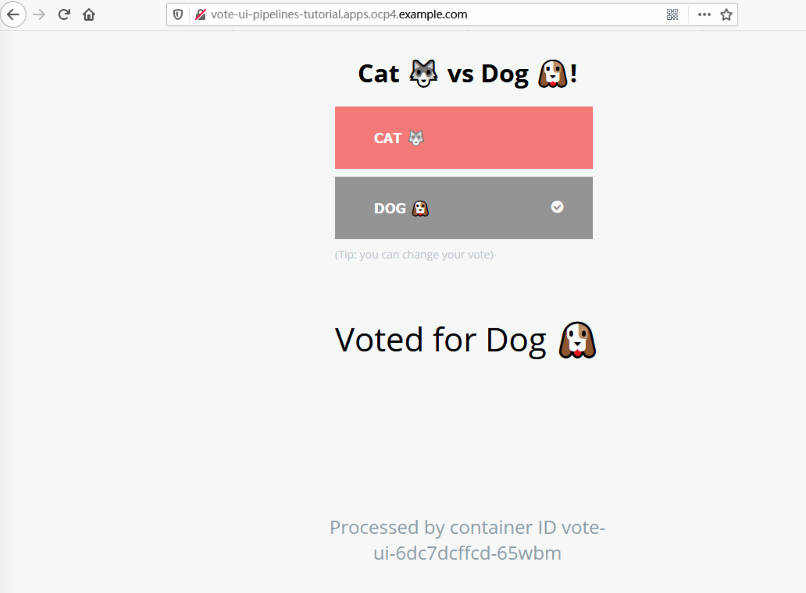

OpenShift Pipeline 是一种云原生，持续集成和交付（CI/CD）解决方案，使用Tekton构建pipeline。  

实现了以模块化方式从源码到应用运行态的自动化流程， 源码->制品->容器镜像->应用发布。并可自定义穿插其他模块，如代码扫描、镜像安全、消息推送等。  

### 1. 模块介绍
OpenShift Pipeline 通过自定义资源对象（CRD）以模块化的方式构建pipeline。  
主要使用的 CRD 有 task, pipeline, pipelinerun, taskrun，trigger  



**Task：**
task 是在 Pipeline 中可配置的最小单元。作为 pipeline 的一部分也可独立运行。每个还可定义多个 step，顺序执行。 比如 buildah 这个 task 就有 build，push， digest-to-results 三个 step。  
task内容主要由 image 和运行脚本组成。spec.params.xx 的值由 pipeline 传入  
task 通常会设计为可重复调用。  
示例  
```bash
apiVersion: tekton.dev/v1beta1
kind: Task
metadata:
  name: update-deployment
spec:
  params:
    - name: deployment
      description: The name of the deployment patch the image
      type: string
    - name: IMAGE
      description: Location of image to be patched with
      type: string
  steps:
    - name: patch
      image: image-registry.openshift-image-registry.svc:5000/openshift/cli:latest
      command: ["/bin/bash", "-c"]
      args:
        - |-
          oc patch deployment $(inputs.params.deployment) --patch='{"spec":{"template":{"spec":{
            "containers":[{
              "name": "$(inputs.params.deployment)",
              "image":"$(inputs.params.IMAGE)"
            }]
          }}}}'
```

**piepeline:**
Pipeline 由一系列 task 组成的通用工作流模板，并会定义 task 的执行顺序。

**PipelineRun：**
PipelineRun 是一个 Pipeline 的运行实例。PipelineRun 启动 Pipeline，并为 Pipeline 中执行的每个任务管理一个 TaskRun 的创建。

**TaskRun：**
PipelineRun 由 Pipeline 中每个任务的 PipelineRun 自动创建。它是在 Pipeline 中运行任务实例的结果。如果某个任务在 Pipeline 之外运行，它也可以被手工创建。

**Workspace：**
Workspace 是一个存储卷，任务（Task）在运行时需要它来接收输入或提供输出。Task 或 Pipeline 会声明 Workspace，一个TaskRun 或 PipelineRun 则会提供存储卷的实际位置，存储卷被挂载到声明的 Workspace 上。这使得任务具有灵活性、可重复使用，并允许在多个任务间共享工作区。  

多个 pipelinerun 共享存储的时候需要注意，有的 task 初始化时候会清除之前的数据，多个 pipelinerun 同时运行并共用存储可能存在数据被清除的情况。

**Trigger：**
Trigger（触发器）捕获外部事件，如 Git 拉取请求，并处理事件有效负载以获取关键信息。

### 2. 安装 Red Hat OpenShift Pipelines Operator

如果离线环境，需要先执行离线部署operatorhub  
https://github.com/cai11745/ocp4-userguide  可参照《离线部署operatorhub并批量导入》

1. 在控制台的 Administrator 视角中，Operators → OperatorHub。
2. 搜索 Red Hat OpenShift Pipelines Operator。点 Red Hat OpenShift Pipelines Operator 。
3. 在 Install Operator 页面中：
Installation Mode 选择 All namespaces on the cluster (default)。选择该项会将 Operator 安装至默认openshift-operators 命名空间，这将启用 Operator 以进行监视并在集群中的所有命名空间中可用。
Approval Strategy（批准策略）选择 Automatic。这样可确保以后对 Operator 的升级由 Operator Lifecycle Manager (OLM) 自动进行。

Update Channel：Stable 频道启用 Red Hat OpenShift Pipelines Operator 最新稳定版本的安装。preview 频道启用 Red Hat OpenShift Pipelines Operator 的最新预览版本，该版本可能包含 Stable 频道中还未提供的功能。

点击 Install。会看到 Installed Operators 页面中列出的 Operator。

检查 Status 变成 Succeeded 表示 Red Hat OpenShift Pipelines Operator 已安装成功。

```bash
查看相关api
[root@bastion ~]# oc api-resources --api-group=tekton.dev
NAME                SHORTNAMES   APIVERSION            NAMESPACED   KIND
clustertasks                     tekton.dev/v1beta1    false        ClusterTask
conditions                       tekton.dev/v1alpha1   true         Condition
pipelineresources                tekton.dev/v1alpha1   true         PipelineResource
pipelineruns        pr,prs       tekton.dev/v1beta1    true         PipelineRun
pipelines                        tekton.dev/v1beta1    true         Pipeline
runs                             tekton.dev/v1alpha1   true         Run
taskruns            tr,trs       tekton.dev/v1beta1    true         TaskRun
tasks                            tekton.dev/v1beta1    true         Task

相关pod  
[root@bastion ~]# oc get pod -n openshift-pipelines
NAME                                             READY   STATUS    RESTARTS   AGE
tekton-operator-proxy-webhook-5c86d47c54-kpcvx   1/1     Running   0          6h42m
tekton-pipelines-controller-78f7f7449d-wrcvb     1/1     Running   0          6h42m
tekton-pipelines-webhook-7885bc985b-54pc5        1/1     Running   0          7h10m
tekton-triggers-controller-76c8d6bd-kwgrk        1/1     Running   0          7h10m
tekton-triggers-webhook-6d6cfb6568-gl779         1/1     Running   0          7h10m
```

### 3. 场景示例

使用 Red Hat OpenShift Pipelines，创建一个自定义的 CI/CD 解决方案来构建、测试和部署应用程序。

主要以下流程：
- 创建自定义task，或使用现有的可重复使用的task。
- 为应用程序创建并定义pipeline。
- 使用持久化存储添加到pipeline的workspace，以保存中间数据，如代码、制品。
- 创建一个 PipelineRun 对象来实例化并调用pipeline。
- 添加trigger以捕获源仓库中的事件。（本文不包含，下一篇做）

使用redhat 官网提供的示例， pipelines-tutorial 来演示。这个示例使用一个简单的应用程序，它由以下部分组成：

一个前端界面 vote-ui，它的源代码在 [ui-repo Git](https://github.com/openshift/pipelines-vote-ui/tree/pipelines-1.3)
一个后端接口 vote-api，它的源代码在 [api-repo Git](https://github.com/openshift/pipelines-vote-api/tree/pipelines-1.3)
apply-manifests 和 update-deployment 任务在 [pipelines-tutorial Git](https://github.com/openshift/pipelines-tutorial/tree/pipelines-1.3) 

#### 3.1 创建新的project

Pipelines Operator 会自动添加并配置一个名为 pipeline 的 ServiceAccount，它有足够的权限来构建和推送镜像。这个 ServiceAccount 由 PipelineRun 使用。

```bash
oc new-project pipelines-tutorial
oc get serviceaccount pipeline
```

#### 3.2 创建 task

安装 tekton client 命令 tkn
```bash
# 下载地址
https://mirror.openshift.com/pub/openshift-v4/clients/pipeline/

wget https://mirror.openshift.com/pub/openshift-v4/clients/pipeline/0.13.1/tkn-linux-amd64-0.13.1.tar.gz
chmod +x tkn 
mv tkn /usr/local/bin/
tkn version
# Client version: 0.13.1
# Pipeline version: v0.19.0
# Triggers version: v0.10.2
```

从 pipelines-tutorial git库安装 apply-manifests 和 update-deployment 任务资源，其中包含可为管道重复使用的任务列表：

```bash
oc create -f https://raw.githubusercontent.com/openshift/pipelines-tutorial/pipelines-1.3/01_pipeline/01_apply_manifest_task.yaml
oc create -f https://raw.githubusercontent.com/openshift/pipelines-tutorial/pipelines-1.3/01_pipeline/02_update_deployment_task.yaml
```

使用 oc get task 或者 tkn task list 命令列出创建的任务：
```bash
[root@bastion 01_pipeline]# oc get task
NAME                AGE
apply-manifests     22s
update-deployment   17s

[root@bastion 01_pipeline]# tkn task list
NAME                DESCRIPTION   AGE
apply-manifests                   5 minutes ago
update-deployment                 5 minutes ago
```
输出会确认创建了 apply-manifests 和 update-deployment 任务

使用 tkn clustertasks list 命令列出由 Operator 安装的额外集群任务，如 buildah 和 s2i-python-3
```bash
[root@bastion 01_pipeline]# tkn clustertasks list
NAME                       DESCRIPTION              AGE
buildah                    Buildah task builds...   1 day ago
buildah-pr                 Buildah task builds...   1 day ago
buildah-pr-v0-19-0         Buildah task builds...   1 day ago
buildah-v0-19-0            Buildah task builds...   1 day ago
git-cli                    This task can be us...   8 hours ago
git-clone                  These Tasks are Git...   1 day ago
......
```

注意: 在内网环境使用 buildah 集群任务，您必须确保 Dockerfile 使用内部镜像流作为基础镜像。

创建存储，必须。
因为每个 task 都是通过pod 执行脚本，pod任务完成后的输出物需要通过存储流转到下一阶段，比如第一步拉取的代码，第二步需要编译，第三步需要做代码扫描。

```bash
~ oc create -f https://raw.githubusercontent.com/openshift/pipelines-tutorial/pipelines-1.3/01_pipeline/03_persistent_volume_claim.yaml 

~ oc get pvc
NAME         STATUS   VOLUME                                     CAPACITY   ACCESS MODES   STORAGECLASS          AGE
source-pvc   Bound    pvc-7c82cb22-65f1-47fb-9ed0-9c4ca5c4f992   500Mi      RWO            managed-nfs-storage   29s
```

#### 3.3 组装 pipeline

pipeline 由多个 task 组成，设计成可以在多个场景下进行复用。

Pipeline 通过使用 from 和 runAfter 参数来指定在不同任务间如何进行交互以及它们执行的顺序。它使用 workspaces 字段指定 Pipeline 中每个任务在执行过程中所需的一个或多个卷。

导入示例 pipeline，此 pipeline 一共有4个阶段，是fetch-repository， build-image， apply-manifests， update-deployment，分别对应4个 task： git-clone（ClusterTask），buildah（ClusterTask）,apply-manifests，update-deployment。 前两个task 是 operator 自带的，全局属性，后两个task是我们刚刚创建的，只在当前 project 生效。

```bash
oc create -f https://raw.githubusercontent.com/openshift/pipelines-tutorial/pipelines-1.3/01_pipeline/04_pipeline.yaml

# 内容解读
[root@bastion 01_pipeline]# cat 04_pipeline.yaml  
apiVersion: tekton.dev/v1beta1
kind: Pipeline
metadata:
  name: build-and-deploy
spec:
  workspaces:
  - name: shared-workspace
  params:
  - name: deployment-name    #与下文tasks 中的params.value 对应，
                            #此处将来可输入参数，回填到tasks.params.value
                            #如果通过web console 运行，params的内容能可视化输入与展示，类似 openshift Template
    type: string
    description: name of the deployment to be patched
  - name: git-url
    type: string
    description: url of the git repo for the code of deployment
  - name: git-revision
    type: string
    description: revision to be used from repo of the code for deployment
    default: "pipelines-1.3"  
  - name: IMAGE
    type: string
    description: image to be build from the code
  tasks:    #tasks.name 有几个就代表有几个步骤，此name为自定义
  - name: fetch-repository
    taskRef:
      name: git-clone  #指定使用的task，此处使用了ClusterTask
      kind: ClusterTask
    workspaces:
    - name: output  #与clustertask git-clone 中spec.workspace.name 一致
      workspace: shared-workspace  #与此yaml文件 spec.workspace.name 一致
    params:
    - name: url    #这个name 与 ClusterTask git-clone 中的 spec.params.name 一致，
                   #将来会把下面的value 回填到 ClusterTask 中进行执行
      value: $(params.git-url)   #与此yaml spec.params.name 
    - name: subdirectory
      value: ""
    - name: deleteExisting
      value: "true"
    - name: revision
      value: $(params.git-revision)
  - name: build-image
    taskRef:
      name: buildah
      kind: ClusterTask
    params:
    - name: TLSVERIFY
      value: "false"
    - name: IMAGE
      value: $(params.IMAGE)
    workspaces:
    - name: source    
      workspace: shared-workspace
    runAfter:    # 启动顺序
    - fetch-repository
  - name: apply-manifests
    taskRef:
      name: apply-manifests   #指定使用的task，没写ClusterTask就说明是当前project的task
    workspaces:
    - name: source
      workspace: shared-workspace
    runAfter:
    - build-image
  - name: update-deployment
    taskRef:
      name: update-deployment
    params:
    - name: deployment
      value: $(params.deployment-name)
    - name: IMAGE
      value: $(params.IMAGE)
    runAfter:
    - apply-manifests

```

Pipeline - spec.params.name 自定义，此name 输入的 value 将传输到 Pipeline - spec.tasks.params.value  
Pipeline - spec.tasks.params.name 与 ClusterTask（Task）中 spec.params.name 一致，Pipeline - spec.tasks.params.value 内容传输到 ClusterTask（Task） 中spec.params.name 的 value。


此处是顺序比较简单，4个 task 一个接一个执行。

在 Web console - Pipelines 菜单可以可视化的查看与执行 pipeline。  
可视化菜单功能为 Tech preview，stable 版本还看不到。



#### 3.4 执行 pipeline

上面是组装了一个 pipeline，包含了4个步骤，包括 clone代码-制作精细-发布应用，但是使用的代码库地址，应用名称还未定义，需要在执行 pipeline 时候自定义。

在 pipeline 详情页，点 Action - Start，会弹出输入参数页面，此处展示的内容就是 04_pipeline.yaml 中 spec.params 部分。
deployment-name： 输入发布应用的名称，自定义  
git-url： git 代码库的地址 https://github.com/openshift/pipelines-vote-api.git  
git-version： 分支名称  
IMAGE： 制作镜像使用的名称，image-registry.openshift-image-registry.svc:5000/pipelines-tutorial/vote-api  依次是内部仓库地址，project-name，deployment-name  
shared-workspace: 选择上面创建的 source-pvc  



pipeline 执行过程，每个 task 都会通过 image 运行 pod 来执行，如果异常可以通过页面或者命令查看 taskrun 状态或者查看在运行pod的event 与log

第二步的日志，根据 git库目录下的 Dockerfile 制作镜像，并推送到内部仓库


第三步的日志，导入 git库 k8s目录的 deployment.yaml 和 service.yaml  


第四步，把 deployment 的 image， 更新成第二步生成的image

除了通过页面，也可以通过 tkn 命令执行 pipeline ，会提示依次输入内容
```bash
[root@bastion 01_pipeline]# tkn pipeline list
NAME               AGE              LAST RUN                  STARTED          DURATION   STATUS
build-and-deploy   51 minutes ago   build-and-deploy-54nl08   12 minutes ago   ---        Running
[root@bastion 01_pipeline]# tkn pipeline start build-and-deploy 
? Value for param `deployment-name` of type `string`? 

```

我这是在线环境，离线环境会遇到镜像拉取的问题，参照官网。
https://access.redhat.com/documentation/zh-cn/openshift_container_platform/4.7/html/cicd/creating-applications-with-cicd-pipelines#op-mirroring-images-to-run-pipelines-in-restricted-environment_creating-applications-with-cicd-pipelines

过程中可以通过 oc get 及 tkn taskrun list 等查看状态。
```bash
[root@bastion 01_pipeline]# oc get pipelineruns.tekton.dev 
NAME                      SUCCEEDED   REASON    STARTTIME   COMPLETIONTIME
build-and-deploy-extr7w   Unknown     Running   3m12s       
[root@bastion 01_pipeline]# oc get taskruns.tekton.dev 
NAME                                             SUCCEEDED   REASON      STARTTIME   COMPLETIONTIME
build-and-deploy-extr7w-build-image-vr96v        Unknown     Running     61s         
build-and-deploy-extr7w-fetch-repository-7kpxj   True        Succeeded   3m19s       61s
[root@bastion 01_pipeline]# oc get pod
NAME                                                       READY   STATUS      RESTARTS   AGE
build-and-deploy-extr7w-build-image-vr96v-pod-hljx8        3/3     Running     0          63s
build-and-deploy-extr7w-fetch-repository-7kpxj-pod-dbjsh   0/1     Completed   0          3m21s
```

完成后，vote-api 后端服务发布完成  
```bash
[root@bastion 01_pipeline]# oc get pod
NAME                                                        READY   STATUS      RESTARTS   AGE
build-and-deploy-47rwhl-apply-manifests-z9mv6-pod-sq5rg     0/1     Completed   0          8m39s
build-and-deploy-47rwhl-build-image-h8kbl-pod-ztwc2         0/3     Completed   0          11m
build-and-deploy-47rwhl-fetch-repository-c5gjx-pod-f95w8    0/1     Completed   0          11m
build-and-deploy-47rwhl-update-deployment-ztzm5-pod-zm4vl   0/1     Completed   0          7m31s
vote-api-c458c6d4f-52xm2                                    1/1     Running     0          7m26s
[root@bastion 01_pipeline]# tkn taskrun list
NAME                                              STARTED          DURATION     STATUS
build-and-deploy-47rwhl-update-deployment-ztzm5   13 minutes ago   4 seconds    Succeeded
build-and-deploy-47rwhl-apply-manifests-z9mv6     14 minutes ago   1 minute     Succeeded
build-and-deploy-47rwhl-build-image-h8kbl         16 minutes ago   2 minutes    Succeeded
build-and-deploy-47rwhl-fetch-repository-c5gjx    17 minutes ago   13 seconds   Succeeded
```

接着按照同样方法发布前端 vote-ui ，这次用 tkn 命令发布
```bash
tkn pipeline start build-and-deploy \
    -w name=shared-workspace,volumeClaimTemplateFile=https://raw.githubusercontent.com/openshift/pipelines-tutorial/pipelines-1.3/01_pipeline/03_persistent_volume_claim.yaml \
    -p deployment-name=vote-ui \
    -p git-url=https://github.com/openshift-pipelines/vote-ui.git \
    -p IMAGE=image-registry.openshift-image-registry.svc:5000/pipelines-tutorial/vote-ui
```

volumeClaimTemplateFile 参数会创建一个随意名称的pvc，和后端使用的不同，如果图形界面去 start vote-ui pipeline，也要提前手动创建不同的pvc。

查看前端域名，访问测试
```bash
[root@bastion 01_pipeline]# oc get route vote-ui --template='http://{{.spec.host}}'

http://vote-ui-pipelines-tutorial.apps.ocp4.example.com

```



其他 tkn 命令  
```bash
# 查看已运行的 pipeline 
[root@bastion 01_pipeline]# tkn pipelinerun list
NAME                         STARTED          DURATION    STATUS
build-and-deploy-run-56kzg   15 minutes ago   5 minutes   Succeeded
build-and-deploy-47rwhl      5 hours ago      4 minutes   Succeeded

# 持续跟踪运行日志
[root@bastion 01_pipeline]# tkn pipelinerun logs build-and-deploy-run-56kzg -f

# 将最后运行的pipelinerun 再运行一次
tkn pipeline start build-and-deploy --last
```

也可以通过页面，对 pipelinerun 选择 Action -> rerun，再次运行。

**总结**  

1.通过 operator 自带的 clustertask及自编task 组成 pipeline 模板，将常用参数提取为输入项。pipeline配合输入参数形成 pipelinerun 执行流水线工作。  
每个task类似jenkins的stage。

2.每个task 都会用到独立的镜像，在离线环境需要提前准备好镜像，或通过 image mirror 方式。

3.demo中应用发布所使用到的yaml，存放在了git，便于管理。其实也可以通过 task 传递，可视化效果更好一些，就是参数会略显繁杂。

4.当前在页面通过start pipeline时候，pipelinerun的名称不能自定义，不利于区分pipelinerun属于哪个应用。

### 4. FAQ  

#### 4.1 task build-image 在 STEP-BUILD 失败，workspace目录找不到代码

启动pipeline 的时候，在Workspace->shared-workspace 没有指定存储。
需要指定已有pvc存储，因为每个task都是独立的pod。第一步拉取的代码的pod完成后，在第二步 build-image 的pod时候无法获取到。需要通过存储流转。

#### 4.2 task build-image 在 STEP-PUSH fail，denied: requested access to the resource is denied

```bash
step-push
+ buildah --storage-driver=vfs push --tls-verify=false --digestfile /workspace/source/image-digest vote-api docker://vote-api
Getting image source signatures
Getting image source signatures
Getting image source signatures
Getting image source signatures
error copying layers and metadata from "containers-storage:[vfs@/var/lib/containers/storage+/var/run/containers/storage]localhost/vote-api:latest" to "docker://vote-api:latest": Error trying to reuse blob sha256:bd3ef8fb78ac28071075811b988706f81ea7f2be36c875592e87287921209862 at destination: Error checking whether a blob sha256:bd3ef8fb78ac28071075811b988706f81ea7f2be36c875592e87287921209862 exists in docker.io/library/vote-api: errors:
denied: requested access to the resource is denied
error parsing HTTP 401 response body: unexpected end of JSON input: ""

level=error msg="exit status 125"

step-digest-to-results
2021/04/14 06:00:23 Skipping step because a previous step failed
```

这是启动 pipeline 时候 IMAGE name 写的不对，如果IMAGE 只写 vote-api 就会出现上面的镜像，镜像就会默认推送到docker.io 当然会没有权限。
把IMAGE 写完整即可 image-registry.openshift-image-registry.svc:5000/pipelines-tutorial/vote-api

#### 4.3 修改 taskrun initcontainers image 地址和其他 pipeline 使用到的镜像  
每个 taskrun 生成的pod都会有看到有 init container，比如
place-tools  
registry.redhat.io/openshift-pipelines-tech-preview/pipelines-entrypoint-rhel8@sha256:395d00fa03ffa37082f4588e1ab6138565875ebe804d05c87ae69d63472216a8

working-dir-initializer  
registry.access.redhat.com/ubi8/ubi-minimal@sha256:5cfbaf45ca96806917830c183e9f37df2e913b187aadb32e89fd83fa455ebaa6

place-scripts  
registry.access.redhat.com/ubi8/ubi-minimal@sha256:5cfbaf45ca96806917830c183e9f37df2e913b187aadb32e89fd83fa455ebaa6

要修改他们为内网地址，可以通过 ImageContentSourcePolicy 重定向。  
也可以找到 pipeline operator 的配置直接修改镜像地址。

在 openshift-operators project 下可以看到 deployment openshift-pipelines-operator， 其中的环境变量可以看到 pipeline operator 使用到的镜像地址。不过直接修改 deployment 是不会生效的。
需要修改 clusterserviceversions  

```bash
[root@bastion ~]# oc -n openshift-operators get deploy
NAME                           READY   UP-TO-DATE   AVAILABLE   AGE
openshift-pipelines-operator   1/1     1            1           13d

          - name: IMAGE_PIPELINES_ARG__SHELL_IMAGE
            value: registry.access.redhat.com/ubi8/ubi-minimal@sha256:fdfb0770bff33e0f97d78583efd68b546a19d0a4b0ac23eef25ef261bca3e975
          - name: IMAGE_PIPELINES_ARG__ENTRYPOINT_IMAGE
            value: registry.redhat.io/openshift-pipelines/pipelines-entrypoint-rhel8@sha256:e77d62854f56f1a09de1dc60d7a2436cb4255af232ca126b3c7a6d8f76a18c68


[root@bastion ~]# oc -n openshift-operators get clusterserviceversions
NAME                                DISPLAY                       VERSION   REPLACES                            PHASE
redhat-openshift-pipelines.v1.4.0   Red Hat OpenShift Pipelines   1.4.0     redhat-openshift-pipelines.v1.3.1   Succeeded

# 修改 csv 中对应环境变量，然后查看 openshift-pipelines-operator pod 是否更新变量  
[root@bastion ~]# oc -n openshift-operators edit clusterserviceversions redhat-openshift-pipelines.v1.4.0

[root@bastion ~]# oc -n openshift-operators get pod

```

此时再执行 pipeline 和task，使用的 init container image 地址就变成了本地仓库

```bash
[root@bastion ~]# oc -n demo-cicd describe pod petclinic-deploy-dev-0z6mit-source-clone-lcndm-pod-bwlg2  

Events:
  Type    Reason          Age    From               Message
  ----    ------          ----   ----               -------
  Normal  Scheduled       7m59s  default-scheduler  Successfully assigned demo-cicd/petclinic-deploy-dev-0z6mit-source-clone-lcndm-pod-bwlg2 to worker3
  Normal  AddedInterface  7m57s  multus             Add eth0 [10.254.5.57/24]
  Normal  Pulling         7m57s  kubelet            Pulling image "registry.example.com:5000/ubi8/ubi-minimal:8.2"
  Normal  Pulled          7m23s  kubelet            Successfully pulled image "registry.example.com:5000/ubi8/ubi-minimal:8.2" in 33.878561435s
  Normal  Created         7m23s  kubelet            Created container place-scripts
  Normal  Started         7m23s  kubelet            Started container place-scripts
  Normal  Pulling         7m23s  kubelet            Pulling image "registry.example.com:5000/openshift-pipelines/pipelines-entrypoint-rhel8:v1.4.0-94"
  Normal  Pulled          6m38s  kubelet            Successfully pulled image "registry.example.com:5000/openshift-pipelines/pipelines-entrypoint-rhel8:v1.4.0-94" in 44.505383656s

```


### 5. 参考链接

https://access.redhat.com/documentation/zh-cn/openshift_container_platform/4.7/html/cicd/creating-applications-with-cicd-pipelines  

https://blog.csdn.net/weixin_43902588/article/details/103269747

