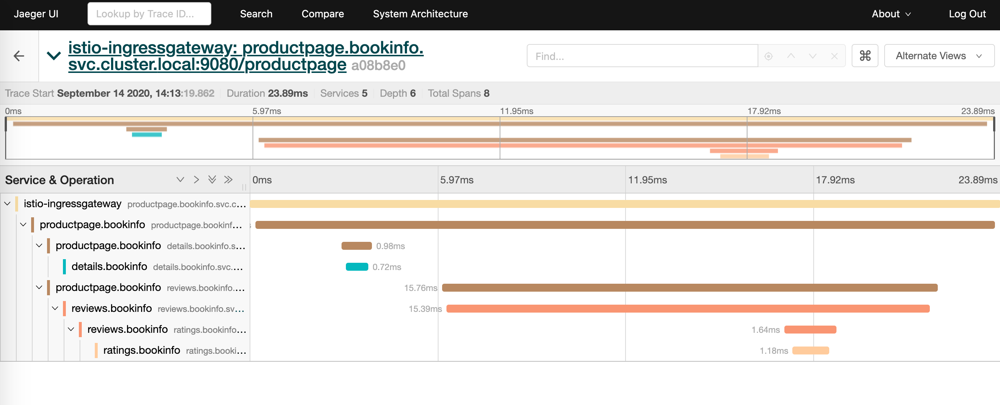

## 部署 istio demo bookinfo

通过 demo 来熟悉 istio 的功能场景。

上游 istio 项目有一个名为 bookinfo 的示例，它由四个独立的微服务组成，用来演示各种 istio 特性。bookinfo 应用程序显示一本书的信息，类似于在线书店的单一目录条目。页面上显示的是对书、书目详情（ISBN 、页数以及其它信息）以及对本书的评论。

Bookinfo 应用程序由这些微服务组成：

productpage 微服务调用 details 和 reviews 微服务来产生页面信息。
details 微服务包括了书的信息。
review 微服务包括了书的评论。它同时还会调用 ratings 微服务。
ratings微服务包括了带有对本书的评论信息的评分信息。
reviews 微服务有三个版本：

版本 v1 不调用 ratings 服务。
版本 v2 调用 ratings 服务，并以一到五个黑色星来代表对本书的评分。
版本 v2 调用 ratings 服务，并以一到五个红色星来代表对本书的评分。

### 前置条件
创建project  ` oc new-project bookinfo `

已经部署好 servicemesh operator，并已经创建了 ServiceMeshControlPlane，已经创建了 ServiceMeshMemberRoll ，且 ServiceMeshMemberRoll 包含了我们即将部署 demo 的project ‘bookinfo’，若未包含，手动添加。
步骤可参考： [ServiceMesh简介与安装](./ServiceMesh简介与istio安装.md)

### 部署 bookinfo
demo 地址：  
https://github.com/maistra/istio/tree/maistra-2.0/samples/bookinfo/platform/kube

```bash
# 通过 bookinfo.yaml 文件在 bookinfo 项目中部署 bookinfo
# 离线环境需要先将 yaml 下载到本地，修改文件中镜像地址，再行导入
oc apply -n bookinfo -f https://raw.githubusercontent.com/Maistra/istio/maistra-2.0/samples/bookinfo/platform/kube/bookinfo.yaml

# 通过 bookinfo-gateway.yaml 文件创建入站网关
oc apply -n bookinfo -f https://raw.githubusercontent.com/Maistra/istio/maistra-2.0/samples/bookinfo/networking/bookinfo-gateway.yaml


# 验证部署结果
# 查看 pod 和 gateway
[root@bastion ~]# oc get pod -n bookinfo
NAME                              READY   STATUS    RESTARTS   AGE
details-v1-556fb7d47-klh6s        2/2     Running   0          8m47s
productpage-v1-7c6ccc7bc7-qz47b   2/2     Running   0          8m47s
ratings-v1-689d4859d7-rw85n       2/2     Running   0          8m44s
reviews-v1-66dcb4df77-l96dp       2/2     Running   0          8m45s
reviews-v2-5fbfb86fd7-fb8gk       2/2     Running   0          8m45s
reviews-v3-787ff9fb6f-92c54       2/2     Running   0          8m42s

[root@bastion networking]# oc get gateway -n bookinfo 
NAME               AGE
bookinfo-gateway   48m
```

**添加默认目的地规则**
在使用 Bookinfo 应用程序前，必须添加默认的目的地规则。根据是否启用了 mutual TLS 验证，预先配置两个 YAML 文件。

要添加目的地规则，运行以下命令之一，我们这边是用第一个，：

```bash
如果没有启用 mutual TLS：
$ oc apply -n bookinfo -f https://raw.githubusercontent.com/Maistra/istio/maistra-2.0/samples/bookinfo/networking/destination-rule-all.yaml

如果启用了 nutual TLS：
$ oc apply -n bookinfo -f https://raw.githubusercontent.com/Maistra/istio/maistra-2.0/samples/bookinfo/networking/destination-rule-all-mtls.yaml
```

创建的是 destinationrule 这个自定义资源对象，DestinationRule 定义了应用有几个可用版本，每个版本对应的pod label 是什么内容。  

**访问demo应用页面**
获取控制平台的 route 地址，并在个人电脑将此域名解析到 ocp router 所在节点IP     
```bash
[root@bastion ~]# oc -n istio-system get route istio-ingressgateway -o jsonpath='{.spec.host}'
istio-ingressgateway-istio-system.apps.ocp4.example.com

```

浏览器访问以下地址应该可以看到 Bookinfo Sample 的页面，反复刷新，在 Book Reviews 处会有三个结果轮流出现  
http://istio-ingressgateway-istio-system.apps.ocp4.example.com/productpage


整体流量的走向是  
1. ocp router, 根据域名 istio-ingressgateway-istio-system.apps.ocp4.example.com 将请求转发到了 isotio-system project 下的 istio-ingressgateway
2. istio-ingressgateway 根据 bookinfo-gateway.yaml 中创建的规则进行转发，bookinfo-gateway.yaml 中 hosts 设置为* ，所以根据 VirtualService 中的路径将请求转发至 productpage 的 9080 端口
3. 而 productpage 在 调用 reviews 服务时， reviews service 关联了 reviews-v1 reviews-v2 reviews-v3 这三个 deployment，所以浏览器页面才会刷新出不同的 BookReviews 结果。后面介绍试通过 destination 来控制访问 reviews 服务的流量。

**访问分布式追踪Jaeger页面**
Jaeger 是一个开源分布式追踪系统。您可以使用 Jaeger 监控基于微服务的分布式系统并进行故障排除。使用 Jaeger ，您可以执行一个追踪（trace），该 trace 会追踪一个请求在组成应用程序的各种微服务间执行的路径。默认安装 Jaeger 作为 Service Mesh 的一部分。

获取 jaeger 访问URL
```bash
[root@bastion networking]# oc get route -n istio-system jaeger -o jsonpath='{.spec.host}'
jaeger-istio-system.apps.ocp4.example.com

浏览器输入，首次登陆需要授权  
https://jaeger-istio-system.apps.ocp4.example.com
```

在 Jaeger 页面左侧，从 Search - Service 菜单中选择 "productpage.bookinfo" 并点击面板底部的 Find Traces 按钮。此时会显示一个跟踪列表，如下所示：
（可以多访问几次上面 bookinfo demo 页面，会展示出最新数据）


Jaeger 在微服务系统中记录的完整的请求执行过程，并显示为 Trace， Trace 是系统的数据/执行路径。一个端到端的 Trace 由一个或多个 Span 组成。

点开 trace 可以查看到详情， 每个trace 由几个嵌套的 span 组成。span 是 Jaeger 的逻辑工作单元，具有请求名称、请求开始时间、请求持续时间。Span 会被嵌套并排序以展示服务间的关系。



### 参考文档
https://access.redhat.com/documentation/zh-cn/openshift_container_platform/4.5/html/service_mesh/ossm-bookinfo-tutorial#ossm-tutorial-bookinfo-overview_ossm-bookinfo-tutorial
https://www.servicemesher.com/istio-handbook/