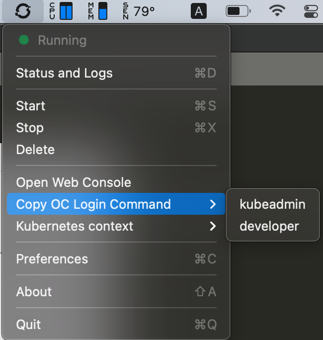
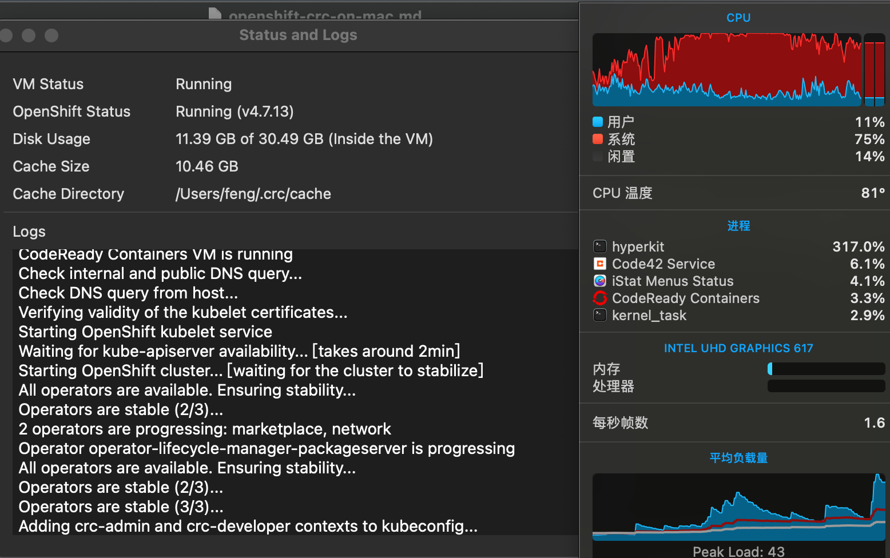
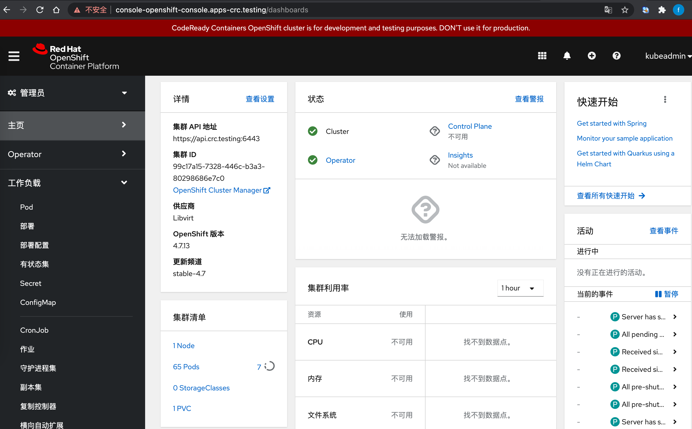

Red Hat CodeReady Containers（crc）用于在笔记本/台式机上构建一个最小化的 OpenShift4 开发/测试环境。

开箱即用，网络顺畅的话，10分钟就可以搞定。支持win10，macos，linux。将虚拟机和运行在虚拟机中的 OpenShift 打包提供给用户。

### 基本介绍

#### 硬件需求

4 physical CPU cores
9 GB of free memory
35 GB of storage space

#### 支持操作系统版本

1. Windows
Windows 10 Fall Creators Update (version 1709) 及之后版本，早于这个的版本不支持。
Microsoft Windows 10 Home Edition 不支持。

2. macOS
macOS 10.14 Mojave 及以上版本。

3. Linux
只支持 Red Hat Enterprise Linux/CentOS 7.5 or newer (including 8.x versions) and on the latest two stable Fedora releases.

#### 与 OpenShift4 标准版的差异

OpenShift4 标准版现在已经不支持单 master 方式，且标准版默认集成 prometheus，所需资源已经无法在普通的台式机或笔记本上运行。  

CRC 不可用于生产环境。  
CRC 没有带 machine-config 和 monitoring operator，及其他一些 ClusterOperator 也有删减。所以监控数据及版本更新的功能是没有了。  
CRC 的域名、网络地址都是采用默认值，不支持自定义。需要注意与外部地址不要冲突。（官网说用的172网段，可我实际部署出来的网段是 10.217.x.x）

### 安装
我的笔记本是 macbook air，双核1.6，16G 内存。可以正常运行，启动 OpenShift 后 CPU 基本拉满了， air的 CPU 太弱鸡了。  

安装包下载地址  
https://cloud.redhat.com/openshift/create/local

安装文档  
https://access.redhat.com/documentation/en-us/red_hat_codeready_containers/1.28/html/getting_started_guide/installation_gsg

mac 安装很简单，按照图形化安装界面的提示一路点下一步就可以了。

装完之后在启动里，有个 CodeReady Containers 图标，居然有图形化的管理工具，比之前的版本更加方便了。



点击启动后，可以通过 log 看到启动过程 



### 使用

#### 虚拟机管理

虚拟机的管理可以通过图形界面。或者 crc 命令。

```bash
➜  ~ crc status 
CRC VM:          Running
OpenShift:       Running (v4.7.13)
Disk Usage:      12.25GB of 32.74GB (Inside the CRC VM)
Cache Usage:     11.21GB
Cache Directory: /Users/feng/.crc/cache
➜  ~ crc -h     
CodeReady Containers is a tool that manages a local OpenShift 4.x cluster optimized for testing and development purposes

Usage:
  crc [flags]
  crc [command]

Available Commands:
  bundle      Manage CRC bundles
  cleanup     Undo config changes
  config      Modify crc configuration
  console     Open the OpenShift Web Console in the default browser
  delete      Delete the OpenShift cluster
  help        Help about any command
  ip          Get IP address of the running OpenShift cluster
  oc-env      Add the 'oc' executable to PATH
  podman-env  Setup podman environment
  setup       Set up prerequisites for the OpenShift cluster
  start       Start the OpenShift cluster
  status      Display status of the OpenShift cluster
  stop        Stop the OpenShift cluster
  version     Print version information

Flags:
  -h, --help               help for crc
      --log-level string   log level (e.g. "debug | info | warn | error") (default "info")

Use "crc [command] --help" for more information about a command.
➜  ~ 
```

#### OpenShift 管理

#### 用户与集群状态

内置了两个默认用户 kubeadmin 和 developer  

在图形界面的 “Copy OC Login Command” 按钮下可以选择两个用户的登录命令，包含用户名密码，和api 地址。

```bash
oc login -u kubeadmin -p iVXn9-7iCrj-26yHs-vNoP5 https://api.crc.testing:6443
oc login -u developer -p developer https://api.crc.testing:6443
```
或者用 crc console --credentials 命令也可以获取以上信息

oc 命令查看集群信息，单节点。  

```bash
➜  ~ oc get node
 oNAME                 STATUS   ROLES           AGE    VERSION
crc-pkjt4-master-0   Ready    master,worker   7d7h   v1.20.0+df9c838

➜  ~  oc get co
NAME                                       VERSION   AVAILABLE   PROGRESSING   DEGRADED   SINCE
authentication                             4.7.13    True        False         False      11h
config-operator                            4.7.13    True        False         False      7d7h
console                                    4.7.13    True        False         False      7d6h
dns                                        4.7.13    True        False         False      12h
etcd                                       4.7.13    True        False         False      7d7h
image-registry                             4.7.13    True        False         False      12h
ingress                                    4.7.13    True        False         False      7d7h
kube-apiserver                             4.7.13    True        False         False      7d7h
kube-controller-manager                    4.7.13    True        False         False      7d7h
kube-scheduler                             4.7.13    True        False         False      7d7h
machine-approver                           4.7.13    True        False         False      7d7h
marketplace                                4.7.13    True        False         False      22m
network                                    4.7.13    True        False         False      7d7h
node-tuning                                4.7.13    True        False         False      12h
openshift-apiserver                        4.7.13    True        False         False      12h
openshift-controller-manager               4.7.13    True        False         False      12h
openshift-samples                          4.7.13    True        False         False      7d7h
operator-lifecycle-manager                 4.7.13    True        False         False      7d7h
operator-lifecycle-manager-catalog         4.7.13    True        False         False      7d7h
operator-lifecycle-manager-packageserver   4.7.13    True        False         False      21m
service-ca                                 4.7.13    True        False         False      7d7h
```

跟我标准版 OpenShift4 对比，少了十个默认 operator  

```bash
[root@bastion ~]# oc get co
NAME                                       VERSION   AVAILABLE   PROGRESSING   DEGRADED   SINCE
authentication                             4.7.5     True        False         False      44m
baremetal                                  4.7.5     True        False         False      4h26m
cloud-credential                           4.7.5     True        False         False      4h52m
cluster-autoscaler                         4.7.5     True        False         False      4h21m
config-operator                            4.7.5     True        False         False      4h26m
console                                    4.7.5     True        False         False      10m
csi-snapshot-controller                    4.7.5     True        False         False      3h43m
dns                                        4.7.5     True        False         False      4h19m
etcd                                       4.7.5     True        False         False      4h23m
image-registry                             4.7.5     True        False         False      4h16m
ingress                                    4.7.5     True        False         False      3h52m
insights                                   4.7.5     True        False         False      4h18m
kube-apiserver                             4.7.5     True        False         False      4h19m
kube-controller-manager                    4.7.5     True        False         False      4h19m
kube-scheduler                             4.7.5     True        False         False      4h22m
kube-storage-version-migrator              4.7.5     True        False         False      3h53m
machine-api                                4.7.5     True        False         False      4h21m
machine-approver                           4.7.5     True        False         False      4h24m
machine-config                             4.7.5     True        False         False      4h16m
marketplace                                4.7.5     True        False         False      4h22m
monitoring                                 4.7.5     True        False         False      7s
network                                    4.7.5     True        False         False      4h26m
node-tuning                                4.7.5     True        False         False      4h21m
openshift-apiserver                        4.7.5     True        False         False      45m
openshift-controller-manager               4.7.5     True        False         False      4h20m
openshift-samples                          4.7.5     True        False         False      42m
operator-lifecycle-manager                 4.7.5     True        False         False      4h21m
operator-lifecycle-manager-catalog         4.7.5     True        False         False      4h21m
operator-lifecycle-manager-packageserver   4.7.5     True        False         False      47m
service-ca                                 4.7.5     True        False         False      4h26m
storage                                    4.7.5     True        False         False      4h26m


```

#### Web Console

打开 web console 通过图形界面的“Open Web Console” 按钮或者命令

crc console  
crc console --url 

页面和 OpenShift4 标准版没什么差别。个别页面会没数据，比如监控、在线版本升级，是因为对应组件在这个版本中没有，不影响主要功能。



#### 测试应用发布

发布一个tomcat 测试下。我们是在虚拟机外面通过 oc 命令连接 OpenShift 集群，所以是不能直接访问到 pod ip的  
需要创建svc，route  

```bash
➜  ~ oc create deploy tomtest --image=docker.io/tomcat

➜  ~ oc get pod -o wide
NAME                       READY   STATUS    RESTARTS   AGE   IP            NODE                 NOMINATED NODE   READINESS GATES
tomtest-76d6788777-snl7x   1/1     Running   0          20m   10.217.0.52   crc-pkjt4-master-0   <none>           <none>

# 给tomcat 建一个 index 文件
➜  ~ oc rsh tomtest-76d6788777-snl7x 
~# bash
root@tomtest-76d6788777-snl7x:/usr/local/tomcat# cd webapps
root@tomtest-76d6788777-snl7x:/usr/local/tomcat/webapps# mkdir ROOT
root@tomtest-76d6788777-snl7x:/usr/local/tomcat/webapps# echo 123 > ROOT/index.html

➜  ~ oc expose deploy tomtest --port=8080
➜  ~ oc expose svc tomtest  

➜  ~ oc get route
NAME           HOST/PORT                               PATH   SERVICES       
tomtest        tomtest-default.apps-crc.testing               tomtest        8080                     None
```

访问一下，返回了我们上面输入到 index.html 的内容“123”。用浏览器也一样。  

```bash
➜  ~ curl tomtest-default.apps-crc.testing
123
```

写在最后，建议你的电脑最好有4核，我的笔记本现在有点烫手。。。或许我应该煎个鸡蛋来做夜宵。

