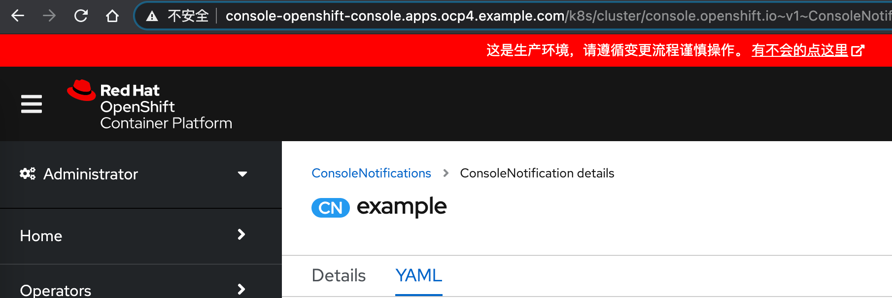
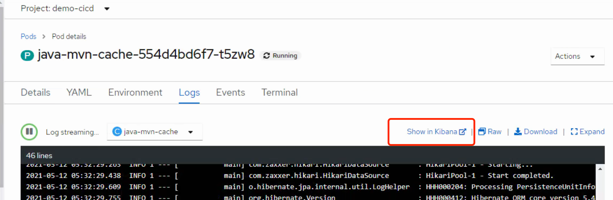
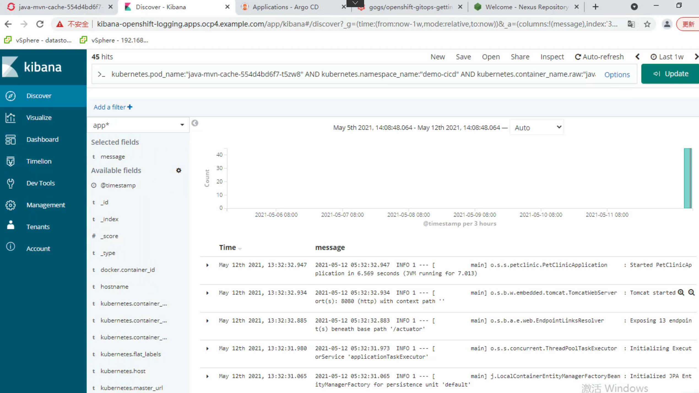
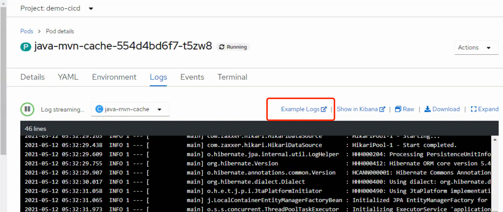
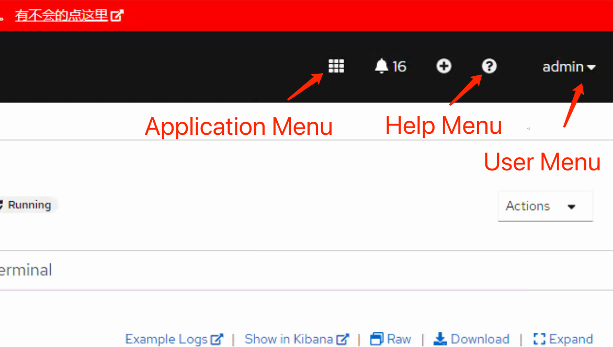
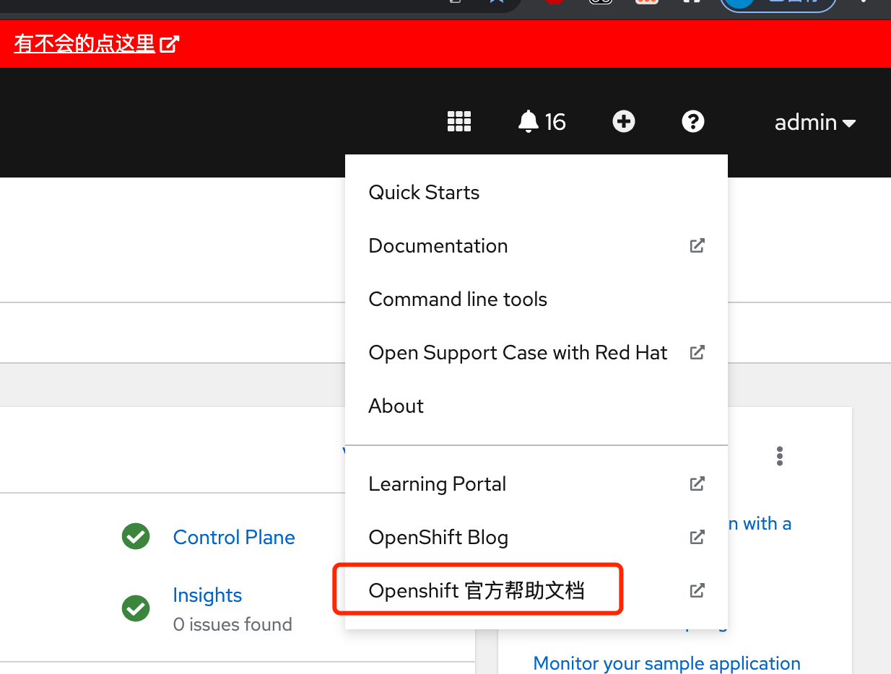
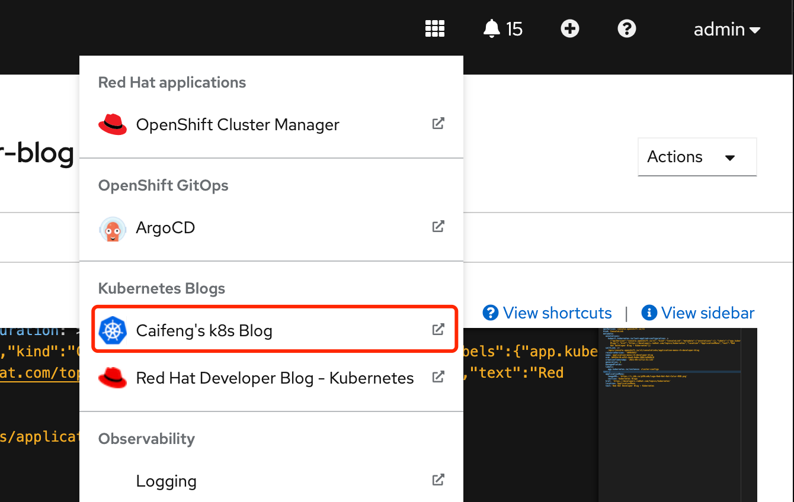
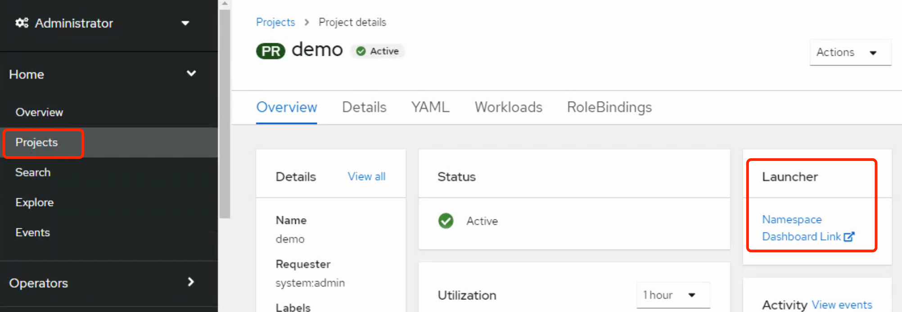
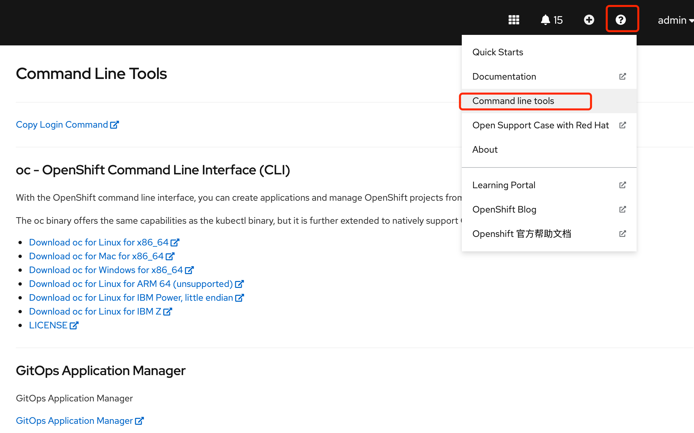

Openshift Web Console 自定义

openshift4 提供了一些CRD 来修改web console，方便我们作一些告示和自定义帮助链接、第三方平台跳转。  
需要注意的是有限修改，改一些为了便捷可视化的内容，毕竟想一想，要在左边加个菜单可不是那么简单的事情。

一共有4个CRD  
ConsoleNotifications       ：定义页面抬头颜色和告示  
ConsoleExternalLogLinks    ：pod 日志外部跳转链接  
ConsoleLinks               ：自定义外部链接  
ConsoleCLIDownloads        ：自定义常用cli工具下载  

另外从 4.7 开始已经增加了中文支持（还有日文），对于新用户更友好一些。

下面具体介绍这4个 CRD 怎么用，及其效果。  
以下操作内容均需 cluster-admin 权限。  

### ConsoleNotifications

这个能干啥呢，比如给不同的环境整个不一样的颜色，免得不小心混了。或者写点什么告诉你的小伙伴生产环境悠着点，还可以写上你队友的电话号码。又或者来个帮助文档的链接，都是ok的。  
后面会介绍另外一种方式可以添加更多链接。



```bash
[root@bastion console-crd]# cat ConsoleNotification.yaml 
apiVersion: console.openshift.io/v1
kind: ConsoleNotification
metadata:
  name: example
spec:
  text: 这是生产环境，请遵循变更流程谨慎操作。
  location: BannerTop ##Other options are BannerBottom, BannerTopBottom
  link:
    href: 'https://www.example.com'
    text: 有不会的点这里
  color: '#fff'
  backgroundColor: red

```

text： 显示的文字内容。  
location： BannerTop 显示在上面，也可以在下面或者上下一起（看着会有点奇怪，哈）。  
link: 超链接了，可以用了跳转帮助文档页面。  
color： 字体颜色。  
backgroundColor： 背景色。  
颜色可以直接写英文，也可以写编码，这边有个对照表。  
http://xh.5156edu.com/page/z1015m9220j18754.html

比如   
MediumBlue	中蓝色	#0000CD  
Gold	金色	#FFD700

### ConsoleExternalLogLinks
针对将日志转发到外部平台的情况。  
现在很多客户都建设了大数据平台，会要求将应用日志发送到统一的日志平台。  
openshift 页面默认的日志跳转是指向平台内部kibana地址的（前提是安装了EFK）。  
如下图  




通过 ConsoleExternalLogLinks 可以定义好外部的日志查询地址和规则，一键跳转，不需要到日志平台再去输入查询规则。  

我没有去实际做转发日志到外部日志服务器，只测试下跳转能力。
```bash
[root@bastion console-crd]# cat ConsoleExternalLogLink.yaml 
apiVersion: console.openshift.io/v1
kind: ConsoleExternalLogLink
metadata:
  name: example
spec:
  hrefTemplate: >-
    https://example.com/logs?resourceName=${resourceName}&containerName=${containerName}&resourceNamespace=${resourceNamespace}&podLabels=${podLabels}
  text: Example Logs

```

导入后，log 页面多了一个跳转按钮。按钮名称就是上面的 text 内容。



### ConsoleLinks

添加自定义超链接。  
有几个地方可以加，分别是 User Menu，Help Menu，Application Menu，NamespaceDashboard



#### User Menu & Help Menu

这两个可配置参数是一样的，location 不同而已。 可用于链接到用户文档、帮助文档。



```bash
[root@bastion console-crd]# cat ConsoleLink-help.yaml 
apiVersion: console.openshift.io/v1
kind: ConsoleLink
metadata:
 name: openshift-help-zh
spec:
 href: 'https://access.redhat.com/documentation/zh-cn/openshift_container_platform/4.7/'
 location: HelpMenu
 text: Openshift 官方帮助文档

 ```

#### Application Menu
用于链接到 openshift 平台组件或者其他平台地址，如git代码库地址，监控等。  
像 openshift GitOps operator， EFK operator 部署完成后，自动添加了两个 Application Menu  
比上面的两个 menu 多了两个参数，section 可以分类，imageURL可以添加一个小logo  

```bash
[root@bastion console-crd]# cat  ConsoleLink-Application.yaml
apiVersion: console.openshift.io/v1
kind: ConsoleLink
metadata:
  name:  applicationmenu-k8s
spec:
  applicationMenu:
    imageURL: data:image/png;base64,iVBORw0KGgoAAAAN........

    section: Kubernetes Blogs
  href: 'https://github.com/cai11745/k8s-ocp-yaml'
  location: ApplicationMenu
  text: Caifeng's k8s Blog
```

imageURL 可以是一个http的在线图片， http://xxx/xx.png  
也可以是png 转成base64，不要用太大的图，我这边用了一个k8s的logo，转完也很多行，我就不贴了。  

随便搜一下 png to base64 就会出来很多在线工具。  
https://onlinepngtools.com/convert-png-to-base64  
https://www.base64-image.de/

效果如下



#### NamespaceDashboard

这是加到 project 页面的，可以指定哪些 project 看到。 

以下指定了 default，demo，demo-cicd 三个project，在 Home -> project 详情页可以看到配置的链接。



```bash
[root@bastion console-crd]# cat ConsoleLink-namspace.yaml 
apiVersion: console.openshift.io/v1
kind: ConsoleLink
metadata:
  name: example-namespace-dashboard
spec:
  href: 'https://www.example.com'
  location: NamespaceDashboard
  text: Namespace Dashboard Link
  namespaceDashboard:
    namespaces:
      - default
      - demo
      - demo-cicd
```

### ConsoleCLIDownloads
用于配置一些 client 工具的下载说明和下载地址。  
系统已经内置了 helm kam oc tkn 这些命令，不过他们的地址都是互联网的，可以修改为我们内网的，或者添加新的工具下载地址。

```bash
[root@bastion console-crd]# oc get ConsoleCLIDownload
NAME                  DISPLAY NAME                                            AGE
helm-download-links   helm - Helm 3 CLI                                       2021-04-08T04:25:11Z
kam                   GitOps Application Manager                              2021-05-10T02:40:34Z
oc-cli-downloads      oc - OpenShift Command Line Interface (CLI)             2021-04-08T06:11:45Z
odo-cli-downloads     odo - Developer-focused CLI for OpenShift               2021-04-08T06:11:45Z
tkn                   tkn - OpenShift Pipeline Command Line Interface (CLI)   2021-04-12T05:31:54Z
```

这些内容通过点击右上角 “？”符号 -> Command Line Tools  
跳转到下载说明页面  


oc 命令的配置页面，可以把 url 改成内网相应内容。

```bash
# Please edit the object below. Lines beginning with a '#' will be ignored,
# and an empty file will abort the edit. If an error occurs while saving this file will be
# reopened with the relevant failures.
#
apiVersion: console.openshift.io/v1
kind: ConsoleCLIDownload
metadata:
  creationTimestamp: "2021-04-08T06:11:45Z"
  generation: 1
  name: oc-cli-downloads
  resourceVersion: "116909"
  selfLink: /apis/console.openshift.io/v1/consoleclidownloads/oc-cli-downloads
  uid: 7cd6735b-3e7c-45b1-b23a-de147d0dcf1b
spec:
  description: |
    With the OpenShift command line interface, you can create applications and manage OpenShift projects from a terminal.

    The oc binary offers the same capabilities as the kubectl binary, but it is further extended to natively support OpenShift Container Platform features.
  displayName: oc - OpenShift Command Line Interface (CLI)
  links:
  - href: https://downloads-openshift-console.apps.ocp4.example.com/amd64/linux/oc.tar
    text: Download oc for Linux for x86_64
  - href: https://downloads-openshift-console.apps.ocp4.example.com/amd64/mac/oc.zip
    text: Download oc for Mac for x86_64
  - href: https://downloads-openshift-console.apps.ocp4.example.com/amd64/windows/oc.zip
    text: Download oc for Windows for x86_64
  - href: https://downloads-openshift-console.apps.ocp4.example.com/arm64/linux/oc.tar
    text: Download oc for Linux for ARM 64 (unsupported)
  - href: https://downloads-openshift-console.apps.ocp4.example.com/ppc64le/linux/oc.tar
    text: Download oc for Linux for IBM Power, little endian
  - href: https://downloads-openshift-console.apps.ocp4.example.com/s390x/linux/oc.tar
    text: Download oc for Linux for IBM Z
  - href: https://downloads-openshift-console.apps.ocp4.example.com/oc-license
    text: LICENSE
```

### 参考链接

https://www.openshift.com/blog/openshift-4-2-console-customization
