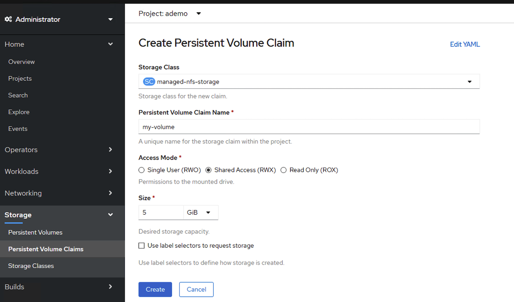

## 使用 nfs-client-provisioner 提供动态存储 storageclass
通常我们使用 nfs 作为openshift 存储的时候，都是需要手动创建pv pvc，使用 nfs-client-provisioner 可以将 nfs server 以storageclass 方式提供，应用在使用存储时，只需指定使用 claim，pv和pvc 将由 nfs-client-provisioner 自动创建。  
PV以 ${namespace}-${pvcName}-${pvName}的命名格式提供（在NFS服务器上）  
PV回收的时候以 archieved-${namespace}-${pvcName}-${pvName} 的命名格式（在NFS服务器上）  

这个步骤建议在集群部署完了就操作，后续内部image_registry、jenkins 等都会用到持久化存储。

### 1. 部署 nfs server

若已有nfs server 或者 nas 跳过此步骤。  
这边把nfs server 部署在 bastion 节点，关闭firewalld 和 selinux  

```bash
yum install nfs-utils -y
mkdir -p /nfs/storageclass
echo "/nfs/storageclass *(rw,sync,all_squash)" >> /etc/exports
chown -R nfsnobody.nfsnobody  /nfs
chmod -R 777 /nfs
systemctl restart nfs-server
systemctl enable nfs-server
```

all_squash：在任何用户挂载 NFS 主机共享目录时，这个使用者的权限将被压缩成为匿名使用者，通常他的 UID 与 GID 都会变成 nfsnobody 那个系统账号的身份。
为了避免多个用户操作同一目录或文件存在的权限问题。

可选步骤：
可以在ocp 节点上测试下挂载 nfs server，测试下写入和删除，无误则nfs server 工作正常


```bash
mkdir /tmp/123
mount -t nfs 192.168.2.19:/nfs/storageclass /tmp/123
sudo mount -t nfs 192.168.2.19:/nfs/storageclass /tmp/123
echo test >/tmp/123/t1.txt
cat /tmp/123/t1.txt
rm -rf /tmp/123/t1.txt
```

### 2. 部署nfs-client-provisioner
前提条件是已有 NFS服务器，并且NFS服务器与Openshift的节点都能网络连通。

https://github.com/kubernetes-sigs/nfs-subdir-external-provisioner.git

把上面整个 git clone 下来，安装文件在 deploy 目录

安装到 default namespace

```bash
cd deploy/
oc project default
# Set the subject of the RBAC objects to the current namespace where the provisioner is being deployed
NAMESPACE=`oc project -q`
sed -i'' "s/namespace:.*/namespace: $NAMESPACE/g" ./deploy/rbac.yaml
oc create -f deploy/rbac.yaml
oc create role use-scc-hostmount-anyuid --verb=use --resource=scc --resource-name=hostmount-anyuid -n $NAMESPACE
oc adm policy add-role-to-user use-scc-hostmount-anyuid system:serviceaccount:$NAMESPACE:nfs-client-provisioner
```

修改 deployment.yaml 中nfs server 的地址和路径  
  env 里的 NFS_SERVER 为 192.168.2.29 和 NFS_PATH 为 /nfs/storageclass
  volumes 里得 nfs.server 为 192.168.2.29 和 nfs.path 为 /nfs/storageclass  
只有一个 storageclass 情况下，PROVISIONER_NAME 不需要改，和下面 class.yaml 中 provisioner 匹配  

```bash
vi deployment.yaml

apiVersion: apps/v1
kind: Deployment
metadata:
  name: nfs-client-provisioner
  labels:
    app: nfs-client-provisioner
  # replace with namespace where provisioner is deployed
  namespace: default
spec:
  replicas: 1
  strategy:
    type: Recreate
  selector:
    matchLabels:
      app: nfs-client-provisioner
  template:
    metadata:
      labels:
        app: nfs-client-provisioner
    spec:
      serviceAccountName: nfs-client-provisioner
      containers:
        - name: nfs-client-provisioner
          image: quay.io/external_storage/nfs-client-provisioner:latest
          volumeMounts:
            - name: nfs-client-root
              mountPath: /persistentvolumes
          env:
            - name: PROVISIONER_NAME
              value: fuseim.pri/ifs
            - name: NFS_SERVER
              value: 192.168.2.29
            - name: NFS_PATH
              value: /nfs/storageclass
      volumes:
        - name: nfs-client-root
          nfs:
            server: 192.168.2.29
            path: /nfs/storageclass
```

修改 class.yaml 增加 annotations 参数设置此 storageclass 为默认  
注意，最多只能有一个 StorageClass 能够被标记为默认。如果它们中有两个或多个被标记为默认，Kubernetes 将忽略这个注解，也就是它将表现为没有默认 StorageClass。  
设为 default 后，应用使用 storageclass 将不需要特别指定 storageclass 名称。  

```bash
vi class.yaml

apiVersion: storage.k8s.io/v1
kind: StorageClass
metadata:
  annotations:
    storageclass.kubernetes.io/is-default-class: "true"
  name: managed-nfs-storage
provisioner: fuseim.pri/ifs # or choose another name, must match deployment's env PROVISIONER_NAME'
parameters:
  archiveOnDelete: "false"
```

provisioner: fuseim.pri/ifs  # 此参数与deployment 中PROVISIONER_NAME变量参数要一致，不用改  
archiveOnDelete： false 字面意思为删除时是否存档,false表示不存档,即删除数据,true表示存档,即重命名路径.  

导入 deployment.yaml class.yaml ,并检查 pod 是否正常运行

```bash
oc create -f deployment.yaml
oc create -f class.yaml

~ oc get pod
NAME                                      READY   STATUS    RESTARTS   AGE
nfs-client-provisioner-76b8ccdf9f-lntm6   1/1     Running   0          29s

~ oc get storageclass
NAME                            PROVISIONER      RECLAIMPOLICY   VOLUMEBINDINGMODE   ALLOWVOLUMEEXPANSION   AGE
managed-nfs-storage (default)   fuseim.pri/ifs   Delete          Immediate           false                  3m42s

```

### 3. 功能验证 （可选项）

deploy 目录下有 test-pod 和 test-claim 

```bash
oc create -f test-claim.yaml
oc create -f test-pod.yaml
```

正确的状态，pvc 状态是 bound， 且有对应的pv
```bash
[root@bastion deploy]# oc get pvc
NAME         STATUS   VOLUME                                     CAPACITY   ACCESS MODES   STORAGECLASS          AGE
test-claim   Bound    pvc-c8352535-20e8-4242-84d2-76c6691329fe   1Mi        RWX            managed-nfs-storage   28s
[root@bastion deploy]# oc get pv
NAME                                       CAPACITY   ACCESS MODES   RECLAIM POLICY   STATUS   CLAIM                STORAGECLASS          REASON   AGE
pvc-c8352535-20e8-4242-84d2-76c6691329fe   1Mi        RWX            Delete           Bound    default/test-claim   managed-nfs-storage            37s
```

pod 运行完成，无异常，在nfs server 上可以看到对应目录生成了一个 SUCCESS 的文件

```bash
[root@bastion deploy]# oc get pod
NAME                                      READY   STATUS      RESTARTS   AGE
nfs-client-provisioner-76b8ccdf9f-lntm6   1/1     Running     0          9m34s
test-pod                                  0/1     Completed   0          5s

[root@bastion ~]# ls /nfs/storageclass/default-test-claim-pvc-c8352535-20e8-4242-84d2-76c6691329fe/
SUCCESS
```

至此，使用 nfs 提供 storageclass 已完成。

### 4. 如何使用 storageclass
由于 pv 会自动创建，我们只要建个 pvc 就行了。

#### 4.1 通过 yaml 创建 pvc
由于我们的 storageclass 已经设置为 default， 所有下面 annotations 的参数可以去掉

```bash
kind: PersistentVolumeClaim
apiVersion: v1
metadata:
  name: test-claim2
#  annotations:
#    volume.beta.kubernetes.io/storage-class: "managed-nfs-storage"
spec:
  accessModes:
    - ReadWriteMany
  resources:
    requests:
      storage: 1Gi
```

#### 4.2 通过 web 页面创建 pvc
在 web 页面，Administrator 角色，Storage--PVC， 点 create， 选择 storageclass，填写 pvc 的name 、读写属性、容量  
完成后会创建 pvc 和 pv



#### 4.3 应用中 volume 指定使用 claim （用于statefulset）

在 statefulset 使用存储时，由于是有状态应用，每个 pod 都是独立的 pvc，这有别于 deployment 所有 pod 使用同一个pvc。  
所以通过 volumeClaimTemplates 来创建一组 pvc， 提供给各个 pod 使用。

```bash
apiVersion: apps/v1beta2
kind: StatefulSet
metadata:
  name: web
spec:
  selector:
    matchLabels:
      app: nginx
  serviceName: "nginx"
  replicas: 2
  template:
    metadata:
      labels:
        app: nginx
    spec:
      containers:
      - name: nginx
        image: nginx
        ports:
        - containerPort: 80
          name: web
        volumeMounts:
        - name: disk-ssd
          mountPath: /data
  volumeClaimTemplates:
  - metadata:
      name: disk-ssd
    spec:
      accessModes: [ "ReadWriteOnce" ]
      resources:
        requests:
          storage: 20Gi
```

volumeClaimTemplates：表示一类PVC的模板，系统会根据Statefulset配置的replicas数量，创建相应数量的PVC。这些PVC除了名字不一样之外其他配置都是一样的。