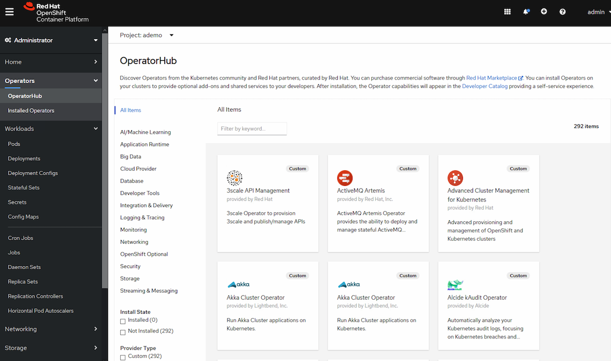
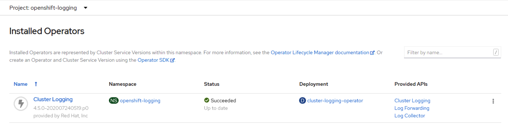
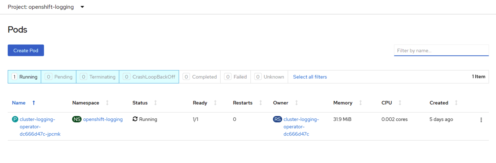

## 离线部署OperatorHub并批量导入operator
openshift4 console 页面集成了operator管理，并支持构建与使用私有的operator仓库，能够对部署完成的operator进行管理。  

本篇主要介绍在离线环境下如何构建一个私有的operatorhub，并批量导入operator 及相关镜像。每个operator 镜像分为两部分，一个是镜像是一直运行来监听自定义的资源对象的，另一部分就是应用实际运行所需的镜像。这个在后续实际部署一个demo 之后可以很清晰的看到。  

operatorhub 在 web console 的ui部分，由 这个project openshift-marketplace 下的 marketplace-operator 提供服务。  

### 1. 禁用默认的 OperatorSources
operator 源分4类，分别是：  

|类别|描述|
|-|-|
|红帽官方|由红帽提供，受红帽官方支持|
|认证合作商|来自领先的独立软件供应商（ISV）的产品。红帽与ISV合作完成。由ISV支持。|
|社区|来自社区，没有官方支持。github可以查到相关软件  [operator-framework/community-operators](https://github.com/operator-framework/community-operators)|
|用户自定义|用户自己添加的operator，如果没有添加，则在web console不会显示这块内容|

ocp4 安装完成后，默认安装了operatorhub， 并配置了默认源。把他屏蔽掉。

```bash
oc patch OperatorHub cluster --type json \
    -p '[{"op": "add", "path": "/spec/disableAllDefaultSources", "value": true}]'

oc get operatorhub -o yaml
# 可以看到几个source, disabled 的值变成了true，已禁用
```

然后过一会 console 页面，operatorhub 里面的内容都自动清空了。

### 2. 导入 operator 源
通过 oc get operatorhub -o yaml 可以看出官方源有 certified-operators community-operators redhat-marketplace redhat-operators，通过在线环境下载镜像，并导入为 CatalogSource，web console 就可以看到相应 operator 内容了。 redhat-marketplace  这个最终镜像拉取在权限上有点问题，我跳过了。  

以 redhat-operators 为例  

#### 2.1 准备 operatorhub 镜像
这个在可联网的节点上做，主要目的是获取镜像，镜像里面是对应源 比如 redhat-operators 下的 operator ，就是一堆yaml 文件的打包，将来operator hub 的页面展示也依赖于这个镜像。如果要部署到离线openshift集群，将最终的镜像导入到集群相应的外部镜像仓库即可。    
先登录私有仓库和redhat 仓库  

```bash
podman login registry.example.com:5000
podman login registry.redhat.io

oc adm catalog build \
    --appregistry-org redhat-operators \
    --from=registry.redhat.io/openshift4/ose-operator-registry:v4.4 \
    --filter-by-os="linux/amd64" \
    --to=registry.example.com:5000/olm/redhat-operators:v1 \
    -a /run/user/0/containers/auth.json
    --insecure

成功后会有提示
Pushed sha256:3adf1abfc4788e5ebbd74363e861771c38cfa406491ffad9d2056ca88d35e1c9 to registry.example.com:5000/olm/redhat-operators:v1
```

--to 是生成的进行，后续如果更新，换个新的tag  
-a 指定 podman login 生成的认证文件，不知道在哪儿用就搜一下 find / -name auth.json  

官方文档提醒，如果有时遇到这种报错，可忽略
```bash
...
INFO[0014] directory                                     dir=/var/folders/st/9cskxqs53ll3wdn434vw4cd80000gn/T/300666084/manifests-829192605 file=4.2 load=package
W1114 19:42:37.876180   34665 builder.go:141] error building database: error loading package into db: fuse-camel-k-operator.v7.5.0 specifies replacement that couldn't be found
Uploading ... 244.9kB/s
```

#### 2.2 导入 operator 镜像
这个同样需要在可联网的节点执行。上一步我们获取到了一个镜像，其中是对应源的 operator包的集合，但是每个 operator 中定义的镜像仓库的地址都是外网地址或者redhat的地址，同步镜像方法有两种下文会介绍，方法2可以选择性同步。我们通过以下命令完成三件事情：
1. 将所有operator 中定义的镜像下载到私有仓库  
2. 生成了一个文件imageContentSourcePolicy.yaml， mirror文件，用于导入到ocp 中，将外部仓库地址映射到我们的私有仓库  
3. 生成了一个mapping.txt， 告诉我们所有的外部镜像地址和其对应的私有仓库地址  

注意：
1. 私有仓库准备足够磁盘空间，并预留足够时间来执行这个步骤。每个源所包含的镜像都比较多，我更新了 community-operators 和 redhat-operators 两个源花了约130G，花了一晚上，十来个小时，这个时间和网络环境还有些关系。
2. 若要将数据流转到ocp离线环境，imageContentSourcePolicy.yaml 需要，及将相关镜像同步到ocp私有仓库，镜像列表可按需选择。

##### 同步方法1： 
全量同步镜像， 完成后会生成 imageContentSourcePolicy.yaml 和 mapping.txt

这一步是同步 operator镜像到私有仓库，第一次会耗时很久    
```bash
oc adm catalog mirror \
    registry.example.com:5000/olm/redhat-operators:v1 \
    registry.example.com:5000 \
    -a /run/user/0/containers/auth.json \
    --insecure \
    --filter-by-os="linux/amd64"

我在更新两个源之后都出现了这个报错，先忽略。  
info: Mirroring completed in 1m7.62s (2.504MB/s)
W0801 09:56:01.998756    8004 mirror.go:258] errors during mirroring. the full contents of the catalog may not have been mirrored: couldn't parse image for mirroring (), skipping mirror: invalid reference format
I0801 09:56:02.034405    8004 mirror.go:329] wrote mirroring manifests to community-operators-manifests
```

oc adm catalog mirror 参数说明:
registry.example.com:5000/olm/redhat-operators:v1 是上一步生成的镜像，里面都是operator yaml包
registry.example.com:5000  这个写私有仓库地址，即把外网镜像同步到哪个私有仓库

导入 image mirror 文件，就是生成的那个 yaml，这个过程会将节点依次设为不可调度并更新容器配置，过程会比较久，慢的可能要一个小时。 节点的容器配置在 /etc/containers/registries.conf  
```bash
[root@bastion operatorhub]# oc apply -f redhat-operators-manifests/
imagecontentsourcepolicy.operator.openshift.io/redhat-operators created
```

imageContentSourcePolicy.yaml 和 mapping.txt 文件的内容格式如下，截取了一小段做展示  

```
[root@bastion operatorhub]# cat redhat-operators-manifests/imageContentSourcePolicy.yaml 
apiVersion: operator.openshift.io/v1alpha1
kind: ImageContentSourcePolicy
metadata:
  name: redhat-operators
spec:
  repositoryDigestMirrors:
  - mirrors:
    - registry.example.com:5000/amq7/amq-streams-kafka-23-rhel7
    source: registry.redhat.io/amq7/amq-streams-kafka-23-rhel7
  - mirrors:
    - registry.example.com:5000/openshift4/ose-local-storage-diskmaker
    source: registry.redhat.io/openshift4/ose-local-storage-diskmaker
  - mirrors:
    - registry.example.com:5000/openshift4/ose-node-feature-discovery
    source: registry.redhat.io/openshift4/ose-node-feature-discovery
...

[root@bastion operatorhub]# cat redhat-operators-manifests/mapping.txt 
registry.redhat.io/amq7/amq-streams-kafka-23-rhel7@sha256:58907d2ce26a9c07f0da06ef0030d086164e83ab7a3c45a1fd52049eacf51d9a=registry.example.com:5000/amq7/amq-streams-kafka-23-rhel7
registry.redhat.io/openshift4/ose-local-storage-diskmaker@sha256:fc436bf96da1e6c20450261a79a07f8c8ce4926ebb90b7bb9446ed65dba040a0=registry.example.com:5000/openshift4/ose-local-storage-diskmaker
registry.redhat.io/openshift4/ose-node-feature-discovery@sha256:145a9787bbd47afc2da78fdd1587ae8879502f3883d3dbbefd63e525b87fffea=registry.example.com:5000/openshift4/ose-node-feature-discovery
registry.redhat.io/3scale-amp2/3scale-rhel7-operator@sha256:6c3b4026a343896dd35e5820c6122815b94d7c682cf55634ea7f6d46f86b3aaa=registry.example.com:5000/3scale-amp2/3scale-rhel7-operator
registry.redhat.io/rhdm-7/rhdm-controller-rhel8@sha256:dd60210a91c833ae5899be8b445d9a3fed38caad8e22151ea807038342a79066=registry.example.com:5000/rhdm-7/rhdm-controller-rhel8

....
```

**注意 FAQ1**
问题描述： 
在4.4 和以下版本，有一个镜像同步的bug，会导致有些镜像同步失败，在operator 部署的时候，会报错 manifest unknown

问题现象：  
比如 cluster-logging 部署的时候，ose-cluster-logging-operator 这个镜像就会找不到，手动oc image mirror 也不会解决  

pod 的 event，是将 registry.redhat.io 映射到了 registry.example.com:5000 ，但是私有仓库也没有这个镜像  
```
Failed to pull image "registry.redhat.io/openshift4/ose-cluster-logging-operator@sha256:ea9f04550350507d30cb9631db053e3a0a66546932997b08af10a61d0c02e803": rpc error: code = Unknown desc = (Mirrors also failed: [registry.example.com:5000/openshift4/ose-cluster-logging-operator@sha256:ea9f04550350507d30cb9631db053e3a0a66546932997b08af10a61d0c02e803: Error reading manifest sha256:ea9f04550350507d30cb9631db053e3a0a66546932997b08af10a61d0c02e803 in registry.example.com:5000/openshift4/ose-cluster-logging-operator: manifest unknown: manifest unknown]): registry.redhat.io/openshift4/ose-cluster-logging-operator@sha256:ea9f04550350507d30cb9631db053e3a0a66546932997b08af10a61d0c02e803: error pinging docker registry registry.redhat.io: Get https://registry.redhat.io/v2/: dial tcp: lookup registry.redhat.io on 192.168.2.19:53: server misbehaving    
```

参照方法2， 从 mapping.txt 将这行内容复制出来，手动 oc image mirror 之后，在 base 节点，podman pull registry.example.com:5000/openshift4/ose-cluster-logging-operator@sha256:ea9f04xxxx  还是失败，说明镜像同步没成功

解决方法：  
https://bugzilla.redhat.com/show_bug.cgi?id=1800674  
在ocp4.5 fix 了。  
其他版本手动通过 skopeo 之前的进行同步操作。  

通过源码安装最新版 skopeo  
```bash
yum install -y golang gpgme-devel libassuan-devel btrfs-progs-devel device-mapper-devel
git clone https://github.com/containers/skopeo
cd skopeo
make bin/skopeo
mv bin/skopeo /usr/local/bin/
```

用 skopeo 命令登录相关仓库  
```bash
skopeo login -u <registry.redhat.io_user> -p <registry.redhat.io_psw> registry.redhat.io
skopeo login -u <registry.example.com_user> -p <registry.example.com_psw> registry.example.com:5000
```

用这个脚本把所有镜像都同步一遍。省的后面再出现找不到镜像的情况。  
```bash
cat redhat-operators-manifests/mapping.txt | while read line; do
  origin=$(echo $line | cut -d= -f1)
  target=$(echo $line | cut -d= -f2)
  if [[ "$origin" =~ "sha256" ]]; then
    tag=$(echo $origin | cut -d: -f2 | cut -c -8)
    skopeo copy --all docker://$origin docker://$target:$tag
  else
    skopeo copy --all docker://$origin docker://$target
  fi
done
```

以上 skopeo 相关命令和脚本来自 "米开朗基杨"  

##### 同步方法2： 
这个方法是在 oc adm catalog mirror 命令加上 --manifests-only=true ，就会先生成文件  imageContentSourcePolicy.yaml 和 mapping.txt，而不执行镜像同步文件。  
而后我们就可以新建一个 mapping2.txt，只保留我们需要的镜像的内容，这样就能选择性同步我们需要的镜像  

```bash
oc adm catalog mirror \
    registry.example.com:5000/olm/redhat-operators:v1 \
    registry.example.com:5000 \
    -a /run/user/0/containers/auth.json \
    --insecure \
    --filter-by-os="linux/amd64" \
    --manifests-only=true

```

在 mapping2.txt 选择我们需要同步的镜像，使用 oc image mirror 命令将其同步到私有仓库  
```bash
# cat mapping2.txt 
registry.redhat.io/rhscl/mysql-57-rhel7@sha256:9a781abe7581cc141e14a7e404ec34125b3e89c008b14f4e7b41e094fd3049fe=registry.example.com:5000/rhscl/mysql-57-rhel7
registry.redhat.io/rhscl/mysql-80-rhel7@sha256:15e3b9e4d048e4d24432b683726dcefcd0b4d225c2f593b046ffdc6d076ad9c2=registry.example.com:5000/rhscl/mysql-80-rhel7

oc image mirror -f mapping2.txt   -a /run/user/0/containers/auth.json     --insecure     --filter-by-os="linux/amd64"
```

针对ocp4.5 以下版本，使用 oc image mirror 命令并不能避开方法1 中所表述的bug。  
如果遇到operator 发布时镜像拉取失败的情况，先在base 节点pull测试，确认仓库中没有这个镜像。 可参照方法1，使用skopeo命令以解决。

#### 2.3 创建 operatorhub 目录源
我们在上文 修改了 OperatorHub cluster， 将默认的在线源都屏蔽了。  
现在我们需要手动添加我们的离线源，这样web console 页面才能看到相应的 operator

创建一个 catalogsource 的资源对象，并导入  

```bash
vim catalogsource-redhat-operators.yaml

apiVersion: operators.coreos.com/v1alpha1
kind: CatalogSource
metadata:
  name: redhat-operators-catalog
  namespace: openshift-marketplace
spec:
  sourceType: grpc
  image: registry.example.com:5000/olm/redhat-operators:v1 
  displayName: My Operator Catalog
  publisher: grpc

# 导入文件
oc create -f catalogsource-redhat-operators.yaml
```

catalogsource 文件的参数说明：  
metadata.name 自己定义，最好和我们的源内容相关，方便记忆  
metadata.namespace 不要改，就是这个
spec.image 就是我们 oc adm catalog mirror 使用的那个镜像

检查 catalogsource 是否生效
```
# 会起一个新的pod，名称是我们上面创建的 catalogsource 名称  
[root@bastion operatorhub]# oc get pods -n openshift-marketplace
NAME                                   READY   STATUS    RESTARTS   AGE
marketplace-operator-77d4cc4d5-rjkn6   1/1     Running   6          12h
redhat-operators-catalog-84vkp         1/1     Running   0          2m54s

[root@bastion operatorhub]# oc get catalogsource -n openshift-marketplace
NAME                       DISPLAY               TYPE   PUBLISHER   AGE
redhat-operators-catalog   My Operator Catalog   grpc   grpc        3m47s

# 能看到很多新加的 operator
[root@bastion operatorhub]# oc get packagemanifest -n openshift-marketplace
NAME                                CATALOG               AGE
amq-broker-lts                      My Operator Catalog   4m1s
eap                                 My Operator Catalog   4m1s
amq-broker                          My Operator Catalog   4m1s
cluster-logging                     My Operator Catalog   4m1s
serverless-operator                 My Operator Catalog   4m1s
...

```

至此，大功告成，可以在web console 页面的 operatorhub 进行操作了，只导入一个 redhat-operators 源，能看到47个operator。最终，redhat-marketplace 这个由于无法获取镜像没导入，其他三个源都导入完成是 292个。 



### 3. 测试通过 operatorhub 部署应用  

随便找一个 operator 测试一下部署即可。  

这边使用 cluster-logging 部署了一下。这个只是一个监听自定义服务的一个进程。  



真实的日志收集组件，日志存储、日志展示模块，在 Installed operator 的详情页进行创建。  
完整的日志系统部署与使用在“日志与监控”章节会介绍。  


